# Diagramas de Arquitectura - Sistema Productor-Consumidor gRPC

## 1. Arquitectura General del Sistema


## 2. Flujo Detallado de Datos


## 3. Componentes del Servidor (Detallado)

```mermaid
graph TB
    subgraph "SERVIDOR GRPC - Puerto 50051"
        subgraph "Productor Thread"
            PLOOP[Loop Infinito]
            PRAND[Generador Random<br/>rand.Intn]
            PHASH[Verificador Unicidad<br/>map[string]bool]
            PLOCK[vectorMutex<br/>sync.Mutex]
            
            PLOOP --> PRAND
            PRAND --> PHASH
            PHASH --> PLOCK
            PLOCK --> PQUEUE
        end
        
        subgraph "Cola de Vectores"
            PQUEUE[Buffered Channel<br/>chan Vector<br/>size: 10,000]
        end
        
        subgraph "RPC Handlers"
            GETNUM[GetNumbers Handler]
            SUBMIT[SubmitResult Handler]
            
            GETNUM --> PQUEUE
            SUBMIT --> STATSMOD
        end
        
        subgraph "Sistema de Estadísticas"
            STATSMOD[Stats Module]
            SLOCK[statsMutex<br/>sync.RWMutex]
            STOTAL[totalResults: int64]
            SSUM[resultSum: int64]
            SCLIENT[clientStats: map]
            
            STATSMOD --> SLOCK
            SLOCK --> STOTAL
            SLOCK --> SSUM
            SLOCK --> SCLIENT
        end
        
        subgraph "Control de Parada"
            STOPFLAG[systemStopped: bool]
            STOPMUX[stopMutex<br/>sync.RWMutex]
            STOPCHAN[stopChan<br/>chan bool]
            
            STOTAL -.->|>=1M| STOPFLAG
            STOPFLAG --> STOPMUX
            STOPMUX --> STOPCHAN
            STOPCHAN -.-> PLOOP
            STOPCHAN -.-> GETNUM
        end
    end
    
    style PLOOP fill:#90EE90
    style PQUEUE fill:#FFE4B5
    style GETNUM fill:#87CEEB
    style SUBMIT fill:#87CEEB
    style STATSMOD fill:#DDA0DD
    style STOPFLAG fill:#FF6B6B
```

## 4. Arquitectura del Cliente

```mermaid
graph TB
    subgraph "CLIENTE - Proceso Independiente"
        START[Inicio]
        CONN[Conexión gRPC<br/>localhost:50051]
        CLIENTID[ID Único del Cliente]
        
        subgraph "Loop Principal"
            REQ[Solicitar Vectores<br/>GetNumbers RPC]
            WAIT[Esperar Respuesta<br/>timeout: 5s]
            CHECK{Vector<br/>Disponible?}
            STOPPED{Sistema<br/>Detenido?}
            CALC[Aplicar Función<br/>suma = n1+n2+n3]
            SEND[Enviar Resultado<br/>SubmitResult RPC]
            RESP[Recibir Confirmación]
            LIMIT{Límite<br/>Alcanzado?}
            
            REQ --> WAIT
            WAIT --> CHECK
            CHECK -->|No| SLEEP[Sleep 100ms]
            SLEEP --> REQ
            CHECK -->|Sí| STOPPED
            STOPPED -->|Sí| END
            STOPPED -->|No| CALC
            CALC --> SEND
            SEND --> RESP
            RESP --> LIMIT
            LIMIT -->|Sí| END
            LIMIT -->|No| REQ
        end
        
        subgraph "Manejo de Errores"
            ERRCOUNT[consecutiveFailures<br/>contador]
            ERRMAX{Errores >= 5?}
            RETRY[Reintento]
            
            WAIT -.->|error| ERRCOUNT
            SEND -.->|error| ERRCOUNT
            ERRCOUNT --> ERRMAX
            ERRMAX -->|No| RETRY
            RETRY --> REQ
            ERRMAX -->|Sí| END
        end
        
        subgraph "Logging"
            LOG[Logger]
            PROG{Cada 1000<br/>resultados?}
            
            RESP --> PROG
            PROG -->|Sí| LOG
        end
        
        START --> CONN
        CONN --> CLIENTID
        CLIENTID --> REQ
    end
    
    END[Finalizar Cliente]
    
    style START fill:#90EE90
    style END fill:#FF6B6B
    style CALC fill:#FFD700
    style LOG fill:#DDA0DD
```



## 5. Diagrama de Sincronización y Locks

```mermaid
graph LR
    subgraph "Recursos Compartidos"
        R1[generatedVectors<br/>map string bool]
        R2[totalResults<br/>int64]
        R3[resultSum<br/>int64]
        R4[clientStats<br/>map string int64]
        R5[systemStopped<br/>bool]
        R6[queue<br/>chan Vector]
    end
    
    subgraph "Mecanismos de Sincronización"
        M1[vectorMutex<br/>sync.Mutex]
        M2[statsMutex<br/>sync.RWMutex]
        M3[stopMutex<br/>sync.RWMutex]
        M4[Channel Semántica<br/>Buffered]
    end
    
    subgraph "Goroutines/Threads"
        T1[Productor]
        T2[GetNumbers RPC 1]
        T3[GetNumbers RPC 2]
        T4[SubmitResult RPC 1]
        T5[SubmitResult RPC 2]
        T6[SubmitResult RPC N]
    end
    
    T1 -->|Lock| M1
    M1 -->|Protege| R1
    
    T2 -->|Read| M4
    T3 -->|Read| M4
    M4 -->|Sincroniza| R6
    T1 -->|Write| M4
    
    T4 -->|Lock| M2
    T5 -->|Lock| M2
    T6 -->|Lock| M2
    M2 -->|Protege| R2
    M2 -->|Protege| R3
    M2 -->|Protege| R4
    
    T4 -->|RLock/Lock| M3
    T5 -->|RLock/Lock| M3
    M3 -->|Protege| R5
    
    style M1 fill:#FF6B6B
    style M2 fill:#87CEEB
    style M3 fill:#FFD700
    style M4 fill:#90EE90
```



## 6. Diagrama de Estados del Sistema


## 7. Diagrama de Despliegue y Comunicación


## 8. Diagrama de Protocolo gRPC (Mensajes)


## 9. Diagrama de Ciclo de Vida de un Vector

```mermaid
graph LR
    START([Inicio]) --> GEN[Generar 3 números<br/>aleatorios 1-1000]
    GEN --> ID[Crear ID<br/>num1-num2-num3]
    ID --> HASH{Existe en<br/>hash map?}
    HASH -->|Sí| GEN
    HASH -->|No| ADD[Agregar a hash map]
    ADD --> VEC[Crear Vector struct<br/>ID, num1, num2, num3]
    VEC --> ENQ{Cola<br/>disponible?}
    ENQ -->|No| WAIT[Esperar 100ms]
    WAIT --> ENQ
    ENQ -->|Sí| QUEUE[Agregar a cola<br/>buffered channel]
    
    QUEUE --> SERVE[Esperar en cola]
    SERVE --> CLI[Cliente solicita<br/>GetNumbers]
    CLI --> SEND[Enviar a cliente]
    
    SEND --> PROC[Cliente procesa<br/>suma = n1+n2+n3]
    PROC --> RESULT[Cliente envía resultado<br/>SubmitResult]
    
    RESULT --> STATS[Actualizar estadísticas<br/>totalResults++<br/>resultSum += suma<br/>clientStats[id]++]
    
    STATS --> CHECK{totalResults<br/>>= 1M?}
    CHECK -->|No| DONE([Vector procesado])
    CHECK -->|Sí| STOP([Sistema detiene])
    
    style START fill:#90EE90
    style GEN fill:#FFE4B5
    style QUEUE fill:#FFD700
    style PROC fill:#FFA07A
    style STATS fill:#DDA0DD
    style STOP fill:#FF6B6B
    style DONE fill:#87CEEB
```

## 10. Arquitectura de Monitoreo y Logging

```mermaid
graph TB
    subgraph "Servidor"
        SEVENTS[Eventos del Servidor]
        SLOG[Server Logger]
        
        SEVENTS --> SLOG
    end
    
    subgraph "Clientes"
        C1E[Eventos Cliente 1]
        C2E[Eventos Cliente 2]
        CNE[Eventos Cliente N]
        
        C1LOG[Client 1 Logger]
        C2LOG[Client 2 Logger]
        CNLOG[Client N Logger]
        
        C1E --> C1LOG
        C2E --> C2LOG
        CNE --> CNLOG
    end
    
    subgraph "Outputs de Log"
        STDOUT[STDOUT<br/>Consola en tiempo real]
        SFILE[server.log<br/>Archivo de logs servidor]
        C1FILE[client_A.log<br/>Archivo de logs cliente A]
        C2FILE[client_B.log<br/>Archivo de logs cliente B]
        CNFILE[client_N.log<br/>Archivo de logs cliente N]
    end
    
    subgraph "Eventos Monitoreados"
        E1[Inicio del servidor]
        E2[Vectores generados cada 10K]
        E3[Progreso cada 10K resultados]
        E4[Clientes procesando cada 1K]
        E5[Errores de conexión]
        E6[Sistema alcanza límite]
        E7[Estadísticas finales]
    end
    
    SLOG --> STDOUT
    SLOG --> SFILE
    C1LOG --> C1FILE
    C2LOG --> C2FILE
    CNLOG --> CNFILE
    
    E1 -.-> SEVENTS
    E2 -.-> SEVENTS
    E3 -.-> SEVENTS
    E4 -.-> C1E
    E4 -.-> C2E
    E4 -.-> CNE
    E5 -.-> C1E
    E5 -.-> C2E
    E5 -.-> CNE
    E6 -.-> SEVENTS
    E7 -.-> SEVENTS
    
    subgraph "Herramientas de Monitoreo"
        TAIL[tail -f<br/>Monitoreo en tiempo real]
        GREP[grep/awk<br/>Filtrado de logs]
    end
    
    SFILE -.-> TAIL
    C1FILE -.-> TAIL
    SFILE -.-> GREP
    
    style SLOG fill:#87CEEB
    style C1LOG fill:#FFA07A
    style C2LOG fill:#FFA07A
    style CNLOG fill:#FFA07A
    style E6 fill:#FF6B6B
```



---

## Leyenda de Colores

- 🟢 **Verde (#90EE90)**: Componentes de producción/generación
- 🔵 **Azul (#87CEEB)**: Componentes de comunicación gRPC
- 🟡 **Amarillo (#FFD700)**: Colas y buffers
- 🟣 **Púrpura (#DDA0DD)**: Estadísticas y monitoreo
- 🟠 **Naranja (#FFA07A)**: Clientes y procesamiento
- 🔴 **Rojo (#FF6B6B)**: Control de parada y errores
- 🟤 **Beige (#FFE4B5)**: Almacenamiento temporal

## Notas Técnicas

### Concurrencia
- **Goroutines**: 1 productor + 1 servidor gRPC + N handlers RPC activos
- **Channels**: 1 buffered channel (10,000 elementos)
- **Mutexes**: 3 tipos (vectorMutex, statsMutex, stopMutex)

### Comunicación
- **Protocolo**: HTTP/2 con Protocol Buffers
- **Puerto**: 50051 (configurable)
- **Timeouts**: 5s en cliente, 2s en servidor

### Escalabilidad
- **Clientes**: N clientes concurrentes (probado con 5+)
- **Throughput**: ~5000 ops/segundo con 5 clientes
- **Límite**: 1,000,000 resultados (configurable)

---

**Generado:** 11 de Noviembre de 2025
**Sistema:** Productor-Consumidor gRPC v1.0
