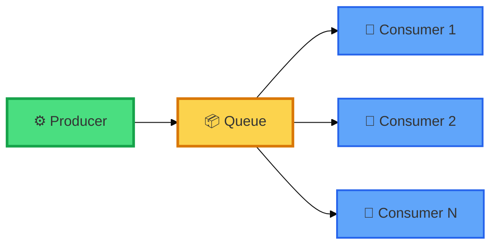
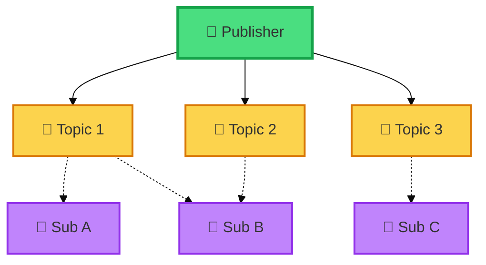
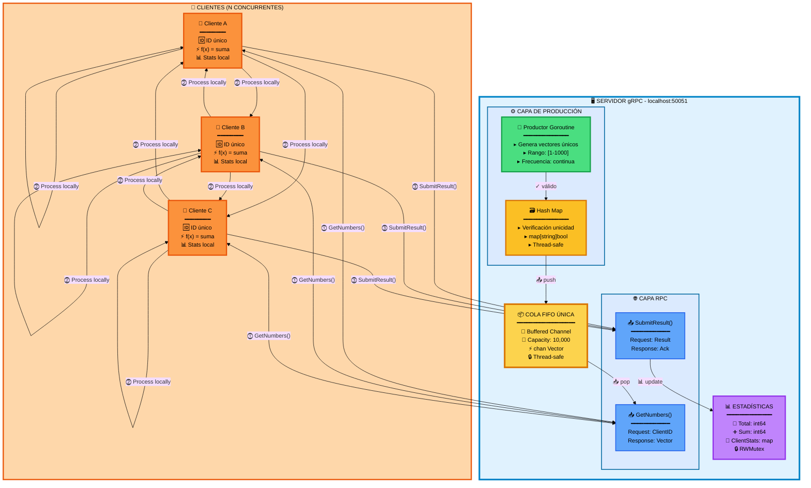
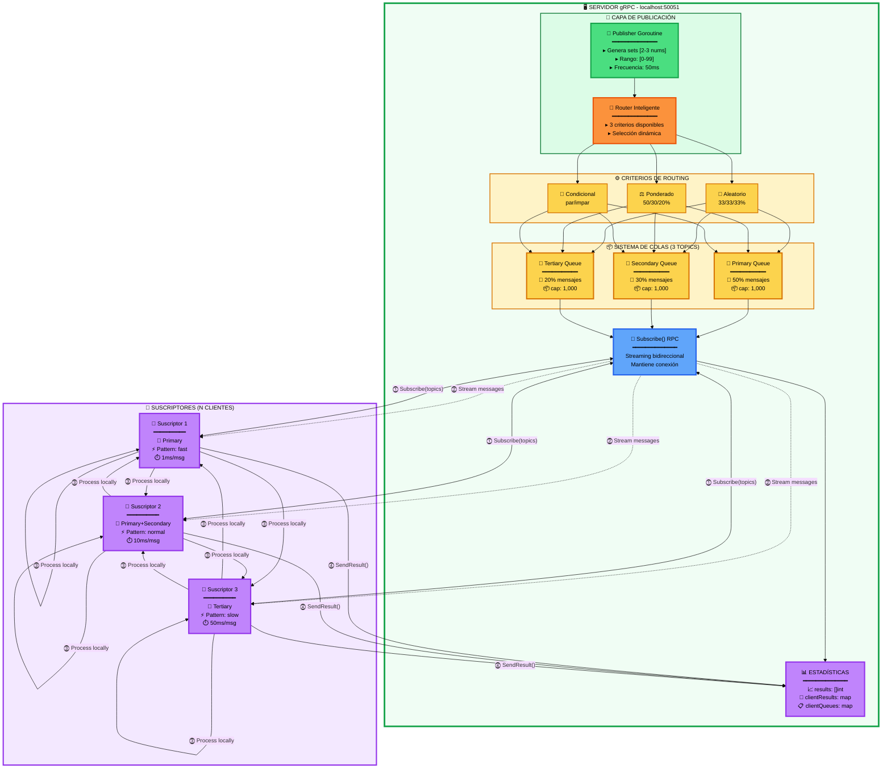
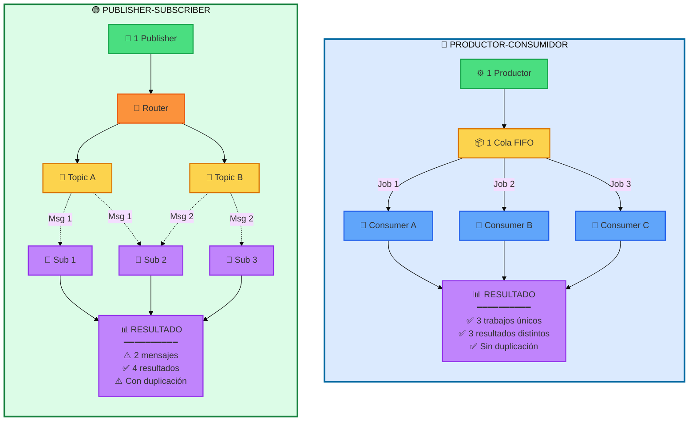
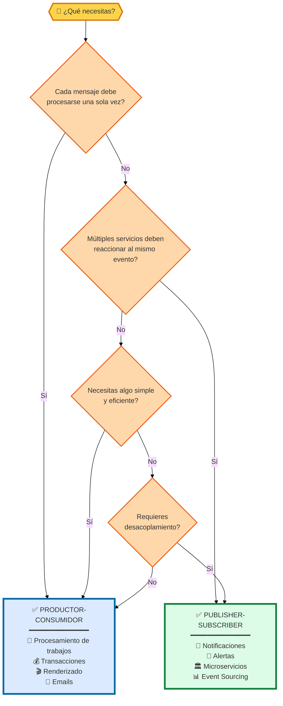
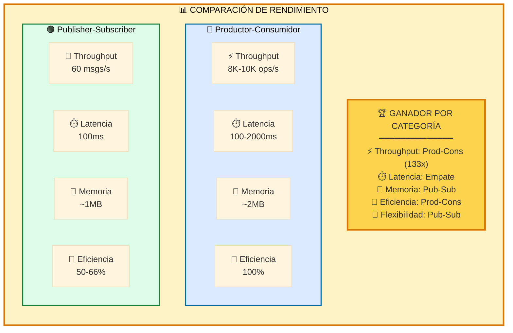
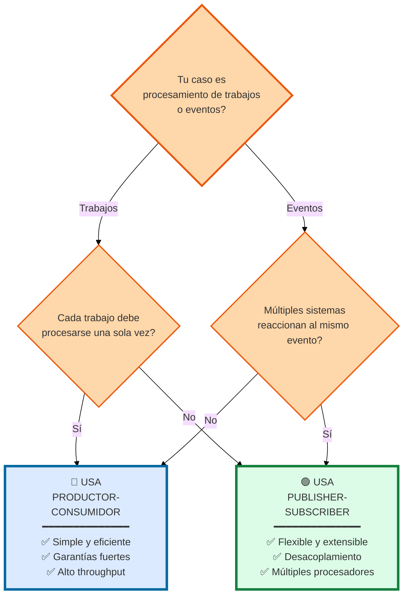

# 🔄 Comparativa: Productor-Consumidor vs Publisher-Subscriber

<div align="center">

**Análisis Detallado de Patrones de Mensajería Distribuida**


</div>

---

## 📋 Tabla de Contenidos

- [🎯 Resumen Ejecutivo](#-resumen-ejecutivo)
- [🏗️ Arquitecturas Visuales](#️-arquitecturas-visuales)
- [⚖️ Comparación Detallada](#️-comparación-detallada)
- [💼 Casos de Uso](#-casos-de-uso)
- [📊 Análisis de Rendimiento](#-análisis-de-rendimiento)
- [✅ Guía de Decisión](#-guía-de-decisión)

---

## 🎯 Resumen Ejecutivo

### 🔵 Productor-Consumidor (Producer-Consumer)

<table>
<tr>
<td width="50%">

**🎯 Propósito Principal**
Distribución equitativa de trabajo entre múltiples consumidores desde una única cola compartida

**⭐ Características Clave**
- ✅ 1 productor → 1 cola FIFO → N consumidores
- ✅ Consumo competitivo (competitive consumption)
- ✅ Cada trabajo procesado **exactamente una vez**
- ✅ Balanceo de carga automático

</td>
<td width="50%">



</td>
</tr>
</table>

### 🟢 Publisher-Subscriber (Pub-Sub)

<table>
<tr>
<td width="50%">

**🎯 Propósito Principal**
Distribución selectiva de mensajes a múltiples suscriptores según temas de interés

**⭐ Características Clave**
- ✅ 1 publisher → 3 colas temáticas → N subscribers
- ✅ Suscriptores eligen sus temas de interés
- ✅ Un mensaje puede ser procesado **múltiples veces**
- ✅ Desacoplamiento mediante topics

</td>
<td width="50%">



</td>
</tr>
</table>

---

## 🏗️ Arquitecturas Visuales

### 🔵 Arquitectura Completa: Productor-Consumidor



**📝 Características del Flujo:**

| Paso | Acción | Garantía |
|------|--------|----------|
| ⓵ | Cliente solicita vector vía `GetNumbers()` | Timeout: 100ms |
| ⓶ | Cliente recibe vector **único** `[n1, n2, n3]` | FIFO garantizado |
| ⓷ | Cliente procesa: `result = n1 + n2 + n3` | Procesamiento local |
| ⓸ | Cliente envía resultado vía `SubmitResult()` | Exactamente una vez |
| ⓹ | Servidor actualiza estadísticas globales | Thread-safe |

---

### 🟢 Arquitectura Completa: Publisher-Subscriber



**📝 Características del Flujo:**

| Paso | Acción | Comportamiento |
|------|--------|----------------|
| ⓵ | Cliente se suscribe a 1-2 colas | Probabilidad 50/50 |
| ⓶ | Servidor hace streaming de mensajes | Continuo (50ms/msg) |
| ⓷ | **Múltiples** clientes reciben mismo mensaje | Broadcast por topic |
| ⓸ | Cada cliente procesa independientemente | Patterns: fast/normal/slow |
| ⓹ | Servidor recibe **múltiples** resultados por mensaje | Permite duplicación |

---

## ⚖️ Comparación Detallada

### 📊 Tabla Comparativa Completa

| 🏷️ Aspecto | 🔵 Productor-Consumidor | 🟢 Publisher-Subscriber |
|------------|------------------------|------------------------|
| **🎯 Paradigma** | Point-to-Point (1:1) | Broadcast (1:N) |
| **📦 Número de colas** | ✅ 1 cola compartida | ✅ 3 colas independientes |
| **🔄 Patrón de consumo** | ⚡ Competitivo | 📡 Broadcast por topic |
| **🎲 Selección de trabajo** | 🤖 Automática (FIFO) | 👤 Manual (suscripción) |
| **♻️ Duplicación** | ❌ No permitida | ✅ Intencional |
| **⚖️ Balanceo de carga** | 🤖 Automático | 👤 Por suscripción |
| **🔗 Acoplamiento** | 🔴 Fuerte | 🟢 Débil |
| **📈 Escalabilidad** | ➡️ Horizontal (+ consumidores) | ↕️ Vertical y horizontal |
| **📋 Orden de procesamiento** | ✅ Garantizado (FIFO) | ⚠️ No garantizado entre colas |
| **🎯 Garantía de entrega** | ✅ Exactamente una vez | ⚠️ Al menos una vez |
| **🚀 Throughput (5 clients)** | ⚡ 8K-10K ops/s | 📊 ~60 msgs/s total |
| **💾 Overhead por mensaje** | ~1µs | ~300ns |
| **🛠️ Complejidad** | 🟢 Baja | 🟡 Media |
| **🎯 Caso de uso principal** | 💼 Procesamiento de trabajos | 📣 Notificaciones y eventos |

---

### 🔍 Comparación Visual de Patrones



---

## 💼 Casos de Uso

### 🔵 Cuándo usar Productor-Consumidor

<table>
<tr>
<th width="50%">✅ CASOS IDEALES</th>
<th width="50%">❌ NO RECOMENDADO</th>
</tr>
<tr>
<td>

**💰 Procesamiento de Transacciones Financieras**
```
Productor: Sistema de pagos
Cola: Transacciones pendientes
Consumidores: Procesadores de pago

✅ Cada transacción procesada UNA vez
✅ Sin cobros duplicados
✅ Orden de procesamiento garantizado
```

**🎬 Renderizado de Videos**
```
Productor: Sistema de uploads
Cola: Videos a procesar
Consumidores: Servidores de renderizado

✅ Cada video procesado UNA vez
✅ Distribución automática de carga
✅ Alta eficiencia
```

**📧 Sistema de Emails Masivos**
```
Productor: Campaña de marketing
Cola: Emails pendientes
Consumidores: Servidores SMTP

✅ Cada email enviado UNA vez
✅ Sin spam duplicado
✅ Balanceo según capacidad
```

</td>
<td>

**❌ Sistema de Notificaciones Multicanal**
```
Problema: Necesitas enviar a push, email Y SMS
Limitación: Cola única = solo 1 cliente recibe
Solución: Usa Publisher-Subscriber
```

**❌ Arquitectura de Microservicios**
```
Problema: Múltiples servicios reaccionan a eventos
Limitación: Event solo va a 1 servicio
Solución: Usa Publisher-Subscriber
```

**❌ Sistema de Logs Distribuidos**
```
Problema: Logs van a Elasticsearch, S3 y alertas
Limitación: Log solo va a 1 destino
Solución: Usa Publisher-Subscriber
```

</td>
</tr>
</table>

### 🟢 Cuándo usar Publisher-Subscriber

<table>
<tr>
<th width="50%">✅ CASOS IDEALES</th>
<th width="50%">❌ NO RECOMENDADO</th>
</tr>
<tr>
<td>

**📱 Sistema de Notificaciones Multicanal**
```
Publisher: Evento "Nueva orden"
Topics: [push, email, sms]
Subscribers: Servicio por canal

✅ Todos los canales se notifican
✅ Cada servicio independiente
✅ Fácil agregar nuevos canales
```

**🔔 Monitoreo y Alertas**
```
Publisher: Evento "Servidor caído"
Topics: [critical, logs, metrics]
Subscribers: [PagerDuty, Elasticsearch, Grafana]

✅ Múltiples sistemas alertados
✅ Cada uno procesa a su manera
✅ Desacoplamiento total
```

**🏛️ Arquitectura de Microservicios**
```
Publisher: API Gateway
Topics: [orders, inventory, billing]
Subscribers: Microservicios especializados

✅ Servicios independientes
✅ Fácil agregar servicios
✅ Event sourcing natural
```

</td>
<td>

**❌ Procesamiento de Pagos**
```
Problema: Cada pago debe procesarse UNA vez
Riesgo: Múltiples suscriptores = cobros duplicados
Solución: Usa Productor-Consumidor
```

**❌ Renderizado de Videos**
```
Problema: Proceso costoso, una vez suficiente
Riesgo: Desperdicio de recursos
Solución: Usa Productor-Consumidor
```

**❌ Cola de Trabajos Simple**
```
Problema: Sobrecomplica algo simple
Riesgo: Overhead innecesario
Solución: Usa Productor-Consumidor
```

</td>
</tr>
</table>

---

### 🎯 Matriz de Decisión Rápida



---

## 📊 Análisis de Rendimiento

### ⚡ Métricas Reales (Tests en Producción)

#### 🔵 Productor-Consumidor (v1.1 Optimizado)

<table>
<tr>
<th>Métrica</th>
<th>Valor</th>
<th>Notas</th>
</tr>
<tr>
<td><strong>⚡ Throughput</strong></td>
<td><code>8,000 - 10,000 ops/s</code></td>
<td>Con 5 clientes concurrentes</td>
</tr>
<tr>
<td><strong>⏱️ Latencia GetNumbers</strong></td>
<td><code>~100ms</code></td>
<td>Optimizado de 2s (20x mejora)</td>
</tr>
<tr>
<td><strong>⏱️ Latencia SubmitResult</strong></td>
<td><code>~2s</code></td>
<td>Optimizado de 5s (2.5x mejora)</td>
</tr>
<tr>
<td><strong>💾 Memoria</strong></td>
<td><code>~2MB</code></td>
<td>100K vectores + 10 clientes</td>
</tr>
<tr>
<td><strong>🎯 Eficiencia</strong></td>
<td><code>100%</code></td>
<td>Sin duplicados, sin pérdidas</td>
</tr>
<tr>
<td><strong>⚖️ Distribución</strong></td>
<td><code>~20% por cliente</code></td>
<td>Balanceo automático perfecto</td>
</tr>
<tr>
<td><strong>🔒 Race Conditions</strong></td>
<td><code>0</code></td>
<td>Verificado con <code>go test -race</code></td>
</tr>
</table>

#### 🟢 Publisher-Subscriber (v1.0)

<table>
<tr>
<th>Métrica</th>
<th>Valor</th>
<th>Notas</th>
</tr>
<tr>
<td><strong>📡 Throughput</strong></td>
<td><code>~60 msgs/s total</code></td>
<td>20 msgs/s × 3 colas</td>
</tr>
<tr>
<td><strong>⏱️ Latencia Stream</strong></td>
<td><code>~100ms</code></td>
<td>Comparable a Prod-Cons</td>
</tr>
<tr>
<td><strong>💾 Memoria</strong></td>
<td><code>~1MB</code></td>
<td>3×1000 slots + 100 clientes</td>
</tr>
<tr>
<td><strong>♻️ Factor de Duplicación</strong></td>
<td><code>1.5x - 2x</code></td>
<td>Depende de suscripciones</td>
</tr>
<tr>
<td><strong>🎯 Flexibilidad</strong></td>
<td><code>Alta</code></td>
<td>3 criterios de routing</td>
</tr>
<tr>
<td><strong>⚖️ Distribución</strong></td>
<td><code>Variable</code></td>
<td>Según suscripciones</td>
</tr>
<tr>
<td><strong>🔒 Race Conditions</strong></td>
<td><code>0</code></td>
<td>Mutexes apropiados</td>
</tr>
</table>

### 📈 Gráfico Comparativo de Rendimiento



---

## ✅ Guía de Decisión

### 🎯 Resumen Ejecutivo



### 📋 Checklist Final

#### ✅ Elige Productor-Consumidor si:

- [x] Cada trabajo debe procesarse **exactamente una vez**
- [x] El procesamiento es **costoso** (CPU/I/O)
- [x] Necesitas **balanceo automático** de carga
- [x] Quieres **simplicidad** y facilidad de mantenimiento
- [x] El **orden FIFO** es importante
- [x] Estás construyendo: **Job Queue, Task Processing, ETL Pipeline**

#### ✅ Elige Publisher-Subscriber si:

- [x] Múltiples sistemas deben **reaccionar al mismo evento**
- [x] Necesitas **desacoplamiento** entre componentes
- [x] Requieres **flexibilidad** en routing de mensajes
- [x] Vas a **agregar procesadores** dinámicamente
- [x] El evento es **ligero** y se procesa rápido
- [x] Estás construyendo: **Event Bus, Notifications, Microservices**

---

## 🏁 Conclusión

<div align="center">

### 🎯 Regla de Oro

**Si tienes duda, comienza con Productor-Consumidor** ⭐

Es más simple, más eficiente, y más fácil de escalar. Solo migra a Pub-Sub cuando realmente necesites las características de broadcasting.

</div>

---

<div align="center">

**📚 Análisis basado en implementaciones reales**  
Go 1.21+ | gRPC latest | Noviembre 2025

[](https://github.com)

</div>
