# 🏗️ Diagramas de Arquitectura Detallados
## 🔄 Productor-Consumidor vs 📡 Publisher-Subscriber

<div align="center">

**Visualización Completa de Arquitecturas Distribuidas**


</div>

---

## 📋 Índice

1. [🎭 Comparación Visual de Alto Nivel](#-comparación-visual-de-alto-nivel)
2. [🔄 Flujo de Secuencia Detallado](#-flujo-de-secuencia-detallado)
3. [🏛️ Arquitectura de Componentes Internos](#️-arquitectura-de-componentes-internos)
4. [🔀 Estados y Ciclo de Vida](#-estados-y-ciclo-de-vida)
5. [🌐 Patrones de Comunicación](#-patrones-de-comunicación)
6. [🔧 Manejo de Errores y Recuperación](#-manejo-de-errores-y-recuperación)
7. [📊 Garantías y Consistencia](#-garantías-y-consistencia)
8. [⚡ Escalabilidad Visual](#-escalabilidad-visual)

---

## 🎭 Comparación Visual de Alto Nivel

### 📐 Vista Panorámica de Ambos Sistemas

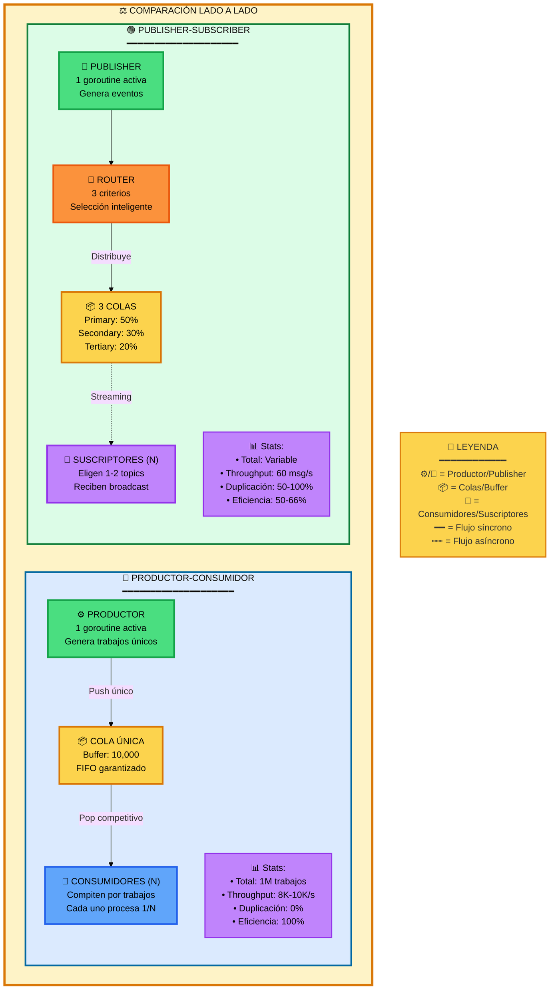
```mermaid
%%{init: {'theme':'base', 'themeVariables': {'fontSize':'16px'}}}%%
graph TB
    subgraph COMPARISON["⚖️ COMPARACIÓN LADO A LADO"]
        direction LR
        
        subgraph PC["🔵 PRODUCTOR-CONSUMIDOR<br/>━━━━━━━━━━━━━━━━━━━━"]
            direction TB
            PC_PROD["⚙️ PRODUCTOR<br/>1 goroutine activa<br/>Genera trabajos únicos"]
            PC_QUEUE["📦 COLA ÚNICA<br/>Buffer: 10,000<br/>FIFO garantizado"]
            PC_CONS["👥 CONSUMIDORES (N)<br/>Compiten por trabajos<br/>Cada uno procesa 1/N"]
            
            PC_PROD -->|"Push único"| PC_QUEUE
            PC_QUEUE -->|"Pop competitivo"| PC_CONS
            
            PC_STATS["📊 Stats:<br/>• Total: 1M trabajos<br/>• Throughput: 8K-10K/s<br/>• Duplicación: 0%<br/>• Eficiencia: 100%"]
        end
        
        subgraph PS["🟢 PUBLISHER-SUBSCRIBER<br/>━━━━━━━━━━━━━━━━━━━━"]
            direction TB
            PS_PUB["📡 PUBLISHER<br/>1 goroutine activa<br/>Genera eventos"]
            PS_ROUTER["🎯 ROUTER<br/>3 criterios<br/>Selección inteligente"]
            
            PS_QUEUES["📦 3 COLAS<br/>Primary: 50%<br/>Secondary: 30%<br/>Tertiary: 20%"]
            
            PS_SUBS["👥 SUSCRIPTORES (N)<br/>Eligen 1-2 topics<br/>Reciben broadcast"]
            
            PS_PUB --> PS_ROUTER
            PS_ROUTER -->|"Distribuye"| PS_QUEUES
            PS_QUEUES -.->|"Streaming"| PS_SUBS
            
            PS_STATS["📊 Stats:<br/>• Total: Variable<br/>• Throughput: 60 msg/s<br/>• Duplicación: 50-100%<br/>• Eficiencia: 50-66%"]
        end
    end
    
    LEGEND["🎨 LEYENDA<br/>━━━━━━━━━━━━<br/>⚙️/📡 = Productor/Publisher<br/>📦 = Colas/Buffer<br/>👥 = Consumidores/Suscriptores<br/>━━ = Flujo síncrono<br/>┉┉ = Flujo asíncrono"]
    
    style COMPARISON fill:#fef3c7,stroke:#d97706,stroke-width:4px
    style PC fill:#dbeafe,stroke:#0369a1,stroke-width:3px
    style PS fill:#dcfce7,stroke:#15803d,stroke-width:3px
    style LEGEND fill:#fcd34d,stroke:#d97706,stroke-width:2px
    
    style PC_PROD fill:#4ade80,stroke:#16a34a,stroke-width:3px,color:#000
    style PC_QUEUE fill:#fcd34d,stroke:#d97706,stroke-width:3px,color:#000
    style PC_CONS fill:#60a5fa,stroke:#2563eb,stroke-width:3px,color:#000
    style PC_STATS fill:#c084fc,stroke:#9333ea,stroke-width:2px,color:#000
    
    style PS_PUB fill:#4ade80,stroke:#16a34a,stroke-width:3px,color:#000
    style PS_ROUTER fill:#fb923c,stroke:#ea580c,stroke-width:3px,color:#000
    style PS_QUEUES fill:#fcd34d,stroke:#d97706,stroke-width:3px,color:#000
    style PS_SUBS fill:#c084fc,stroke:#9333ea,stroke-width:3px,color:#000
    style PS_STATS fill:#c084fc,stroke:#9333ea,stroke-width:2px,color:#000
```

---

## 🔄 Flujo de Secuencia Detallado

### 🔵 Productor-Consumidor: Interacción Completa

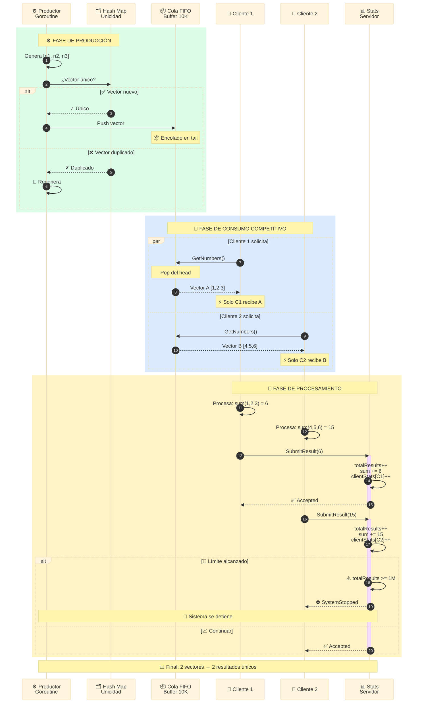
```mermaid
%%{init: {'theme':'base', 'themeVariables': {'fontSize':'14px'}}}%%
sequenceDiagram
    autonumber
    participant P as ⚙️ Productor<br/>Goroutine
    participant H as 🗂️ Hash Map<br/>Unicidad
    participant Q as 📦 Cola FIFO<br/>Buffer 10K
    participant C1 as 👤 Cliente 1
    participant C2 as 👤 Cliente 2
    participant S as 📊 Stats<br/>Servidor
    
    rect rgb(220, 252, 231)
        Note over P,H: ⚙️ FASE DE PRODUCCIÓN
        P->>P: Genera [n1, n2, n3]
        P->>H: ¿Vector único?
        
        alt ✅ Vector nuevo
            H-->>P: ✓ Único
            P->>Q: Push vector
            Note over Q: 📦 Encolado en tail
        else ❌ Vector duplicado
            H-->>P: ✗ Duplicado
            P->>P: 🔄 Regenera
        end
    end
    
    rect rgb(219, 234, 254)
        Note over Q,C2: 👥 FASE DE CONSUMO COMPETITIVO
        
        par Cliente 1 solicita
            C1->>Q: GetNumbers()
            Note over Q: Pop del head
            Q-->>C1: Vector A [1,2,3]
            Note over C1: ⚡ Solo C1 recibe A
        and Cliente 2 solicita
            C2->>Q: GetNumbers()
            Q-->>C2: Vector B [4,5,6]
            Note over C2: ⚡ Solo C2 recibe B
        end
    end
    
    rect rgb(254, 243, 199)
        Note over C1,S: 🔄 FASE DE PROCESAMIENTO
        
        C1->>C1: Procesa: sum(1,2,3) = 6
        C2->>C2: Procesa: sum(4,5,6) = 15
        
        C1->>S: SubmitResult(6)
        activate S
        S->>S: totalResults++<br/>sum += 6<br/>clientStats[C1]++
        S-->>C1: ✅ Accepted
        deactivate S
        
        C2->>S: SubmitResult(15)
        activate S
        S->>S: totalResults++<br/>sum += 15<br/>clientStats[C2]++
        
        alt 🎯 Límite alcanzado
            S->>S: ⚠️ totalResults >= 1M
            S-->>C2: ⛔ SystemStopped
            Note over P,S: 🛑 Sistema se detiene
        else 📈 Continuar
            S-->>C2: ✅ Accepted
        end
        deactivate S
    end
    
    Note over P,S: 📊 Final: 2 vectores → 2 resultados únicos
```

**🎯 Características Clave:**
- ✅ **Unicidad**: Hash map previene duplicados (líneas 5-11)
- ✅ **Competencia**: Solo 1 cliente recibe cada vector (líneas 15-22)
- ✅ **Orden**: FIFO estricto en cola (línea 17)
- ✅ **Atomicidad**: Stats protegidas con mutex (líneas 27-41)

---

### 🟢 Publisher-Subscriber: Interacción Completa

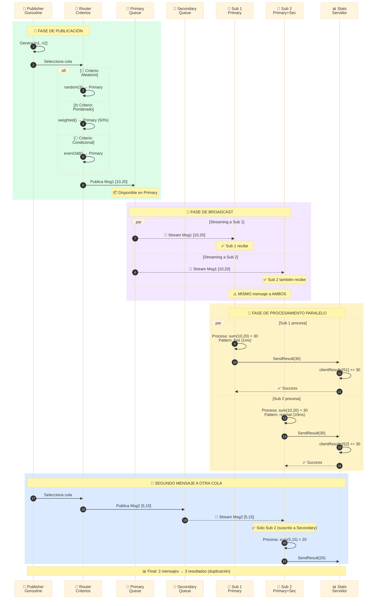
```mermaid
%%{init: {'theme':'base', 'themeVariables': {'fontSize':'14px'}}}%%
sequenceDiagram
    autonumber
    participant P as 📡 Publisher<br/>Goroutine
    participant R as 🎯 Router<br/>Criterios
    participant Q1 as 📌 Primary<br/>Queue
    participant Q2 as 📌 Secondary<br/>Queue
    participant S1 as 👥 Sub 1<br/>Primary
    participant S2 as 👥 Sub 2<br/>Primary+Sec
    participant ST as 📊 Stats<br/>Servidor
    
    rect rgb(220, 252, 231)
        Note over P,R: 📡 FASE DE PUBLICACIÓN
        P->>P: Genera [n1, n2]
        P->>R: Selecciona cola
        
        alt 🎲 Criterio: Aleatorio
            R->>R: random(3) → Primary
        else ⚖️ Criterio: Ponderado
            R->>R: weighted() → Primary (50%)
        else 🔢 Criterio: Condicional
            R->>R: evenOdd() → Primary
        end
        
        R->>Q1: Publica Msg1 [10,20]
        Note over Q1: 📦 Disponible en Primary
    end
    
    rect rgb(243, 232, 255)
        Note over Q1,S2: 📡 FASE DE BROADCAST
        
        par Streaming a Sub 1
            Q1-->>S1: 📨 Stream Msg1 [10,20]
            Note over S1: ✅ Sub 1 recibe
        and Streaming a Sub 2
            Q1-->>S2: 📨 Stream Msg1 [10,20]
            Note over S2: ✅ Sub 2 también recibe
        end
        
        Note over S1,S2: ⚠️ MISMO mensaje a AMBOS
    end
    
    rect rgb(254, 243, 199)
        Note over S1,ST: 🔄 FASE DE PROCESAMIENTO PARALELO
        
        par Sub 1 procesa
            S1->>S1: Procesa: sum(10,20) = 30<br/>Pattern: fast (1ms)
            S1->>ST: SendResult(30)
            ST->>ST: clientResults[S1] += 30
            ST-->>S1: ✅ Success
        and Sub 2 procesa
            S2->>S2: Procesa: sum(10,20) = 30<br/>Pattern: normal (10ms)
            S2->>ST: SendResult(30)
            ST->>ST: clientResults[S2] += 30
            ST-->>S2: ✅ Success
        end
    end
    
    rect rgb(219, 234, 254)
        Note over P,ST: 📡 SEGUNDO MENSAJE A OTRA COLA
        P->>R: Selecciona cola
        R->>Q2: Publica Msg2 [5,15]
        
        Q2-->>S2: 📨 Stream Msg2 [5,15]
        Note over S2: ✅ Solo Sub 2 (suscrito a Secondary)
        
        S2->>S2: Procesa: sum(5,15) = 20
        S2->>ST: SendResult(20)
    end
    
    Note over P,ST: 📊 Final: 2 mensajes → 3 resultados (duplicación)
```

**🎯 Características Clave:**
- ✅ **Broadcast**: Mismo mensaje a múltiples suscriptores (líneas 25-32)
- ✅ **Paralelismo**: Procesamiento simultáneo (líneas 38-49)
- ⚠️ **Duplicación**: Intencional por diseño (línea 34)
- ✅ **Flexibilidad**: Routing por criterios (líneas 11-19)

---

## 🏛️ Arquitectura de Componentes Internos

### 🔵 Productor-Consumidor: Diagrama de Componentes

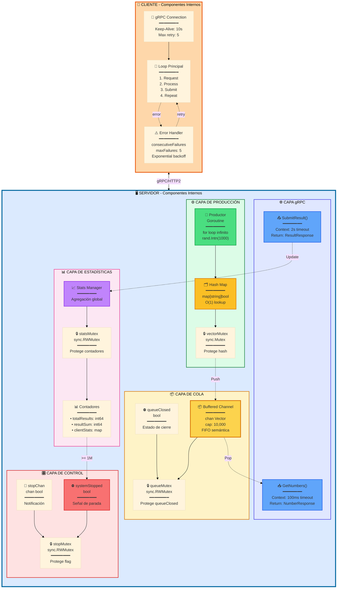
```mermaid
%%{init: {'theme':'base'}}%%
graph TB
    subgraph SERVER["🖥️ SERVIDOR - Componentes Internos"]
        direction TB
        
        subgraph PROD_LAYER["⚙️ CAPA DE PRODUCCIÓN"]
            direction LR
            PROD_GO["🔄 Productor<br/>Goroutine<br/>━━━━━━━━<br/>for loop infinito<br/>rand.Intn(1000)"]
            HASH_MAP["🗂️ Hash Map<br/>━━━━━━━━<br/>map[string]bool<br/>O(1) lookup"]
            VEC_MUX["🔒 vectorMutex<br/>sync.Mutex<br/>━━━━━━━━<br/>Protege hash"]
            
            PROD_GO --> HASH_MAP
            HASH_MAP --> VEC_MUX
        end
        
        subgraph QUEUE_LAYER["📦 CAPA DE COLA"]
            direction LR
            BUF_CHAN["📦 Buffered Channel<br/>━━━━━━━━<br/>chan Vector<br/>cap: 10,000<br/>FIFO semántica"]
            Q_MUX["🔒 queueMutex<br/>sync.RWMutex<br/>━━━━━━━━<br/>Protege queueClosed"]
            Q_CLOSED["⛔ queueClosed<br/>bool<br/>━━━━━━━━<br/>Estado de cierre"]
            
            BUF_CHAN --> Q_MUX
            Q_CLOSED --> Q_MUX
        end
        
        subgraph RPC_LAYER["🌐 CAPA gRPC"]
            direction LR
            GET_NUM["📥 GetNumbers()<br/>━━━━━━━━<br/>Context: 100ms timeout<br/>Return: NumberResponse"]
            SUBMIT["📤 SubmitResult()<br/>━━━━━━━━<br/>Context: 2s timeout<br/>Return: ResultResponse"]
        end
        
        subgraph STATS_LAYER["📊 CAPA DE ESTADÍSTICAS"]
            direction LR
            STATS_MGR["📈 Stats Manager<br/>━━━━━━━━<br/>Agregación global"]
            STATS_MUX["🔒 statsMutex<br/>sync.RWMutex<br/>━━━━━━━━<br/>Protege contadores"]
            
            COUNTERS["📊 Contadores<br/>━━━━━━━━<br/>• totalResults: int64<br/>• resultSum: int64<br/>• clientStats: map"]
            
            STATS_MGR --> STATS_MUX
            STATS_MUX --> COUNTERS
        end
        
        subgraph CONTROL_LAYER["🎛️ CAPA DE CONTROL"]
            direction LR
            STOP_FLAG["⛔ systemStopped<br/>bool<br/>━━━━━━━━<br/>Señal de parada"]
            STOP_MUX["🔒 stopMutex<br/>sync.RWMutex<br/>━━━━━━━━<br/>Protege flag"]
            STOP_CHAN["📡 stopChan<br/>chan bool<br/>━━━━━━━━<br/>Notificación"]
            
            STOP_FLAG --> STOP_MUX
            STOP_CHAN --> STOP_MUX
        end
        
        VEC_MUX -.->|"Push"| BUF_CHAN
        BUF_CHAN -.->|"Pop"| GET_NUM
        SUBMIT -.->|"Update"| STATS_MGR
        COUNTERS -.->|">= 1M"| STOP_FLAG
    end
    
    subgraph CLIENT["👤 CLIENTE - Componentes Internos"]
        direction TB
        
        CONN["🔌 gRPC Connection<br/>━━━━━━━━<br/>Keep-Alive: 10s<br/>Max retry: 5"]
        
        LOOP["🔁 Loop Principal<br/>━━━━━━━━<br/>1. Request<br/>2. Process<br/>3. Submit<br/>4. Repeat"]
        
        ERR_HAND["⚠️ Error Handler<br/>━━━━━━━━<br/>consecutiveFailures<br/>maxFailures: 5<br/>Exponential backoff"]
        
        CONN --> LOOP
        LOOP -.->|"error"| ERR_HAND
        ERR_HAND -.->|"retry"| LOOP
    end
    
    CLIENT <-->|"gRPC/HTTP2"| SERVER
    
    style SERVER fill:#dbeafe,stroke:#0369a1,stroke-width:4px
    style PROD_LAYER fill:#dcfce7,stroke:#15803d,stroke-width:2px
    style QUEUE_LAYER fill:#fef3c7,stroke:#d97706,stroke-width:2px
    style RPC_LAYER fill:#e0e7ff,stroke:#4f46e5,stroke-width:2px
    style STATS_LAYER fill:#fce7f3,stroke:#ec4899,stroke-width:2px
    style CONTROL_LAYER fill:#fee2e2,stroke:#dc2626,stroke-width:2px
    style CLIENT fill:#fed7aa,stroke:#ea580c,stroke-width:3px
    
    style PROD_GO fill:#4ade80,stroke:#16a34a,stroke-width:2px
    style HASH_MAP fill:#fbbf24,stroke:#d97706,stroke-width:2px
    style BUF_CHAN fill:#fcd34d,stroke:#d97706,stroke-width:3px
    style GET_NUM fill:#60a5fa,stroke:#2563eb,stroke-width:2px
    style SUBMIT fill:#60a5fa,stroke:#2563eb,stroke-width:2px
    style STATS_MGR fill:#c084fc,stroke:#9333ea,stroke-width:2px
    style STOP_FLAG fill:#f87171,stroke:#dc2626,stroke-width:2px
```

**🔧 Detalles Técnicos:**

<table>
<tr>
<th>Capa</th>
<th>Responsabilidad</th>
<th>Concurrencia</th>
</tr>
<tr>
<td><strong>⚙️ Producción</strong></td>
<td>Generar vectores únicos continuamente</td>
<td>1 goroutine + Mutex para hash</td>
</tr>
<tr>
<td><strong>📦 Cola</strong></td>
<td>Buffer FIFO thread-safe</td>
<td>Channel nativo (thread-safe)</td>
</tr>
<tr>
<td><strong>🌐 RPC</strong></td>
<td>Handlers para clientes</td>
<td>N goroutines (1 por request)</td>
</tr>
<tr>
<td><strong>📊 Stats</strong></td>
<td>Agregación de resultados</td>
<td>RWMutex para lecturas concurrentes</td>
</tr>
<tr>
<td><strong>🎛️ Control</strong></td>
<td>Señalización de parada</td>
<td>RWMutex + channel para broadcast</td>
</tr>
</table>

---

### 🟢 Publisher-Subscriber: Diagrama de Componentes

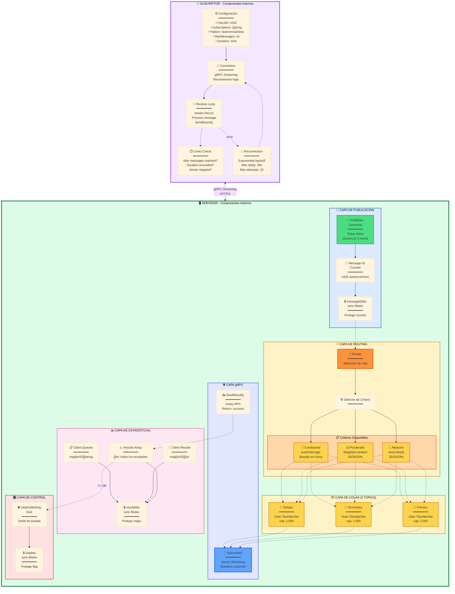
```mermaid
%%{init: {'theme':'base'}}%%
graph TB
    subgraph SERVER["🖥️ SERVIDOR - Componentes Internos"]
        direction TB
        
        subgraph PUB_LAYER["📡 CAPA DE PUBLICACIÓN"]
            direction LR
            PUB_GO["🔄 Publisher<br/>Goroutine<br/>━━━━━━━━<br/>Ticker 50ms<br/>Genera [2-3 nums]"]
            MSG_ID["🔢 Message ID<br/>Counter<br/>━━━━━━━━<br/>int32 autoincrement"]
            MSG_MUX["🔒 messageIDMu<br/>sync.Mutex<br/>━━━━━━━━<br/>Protege counter"]
            
            PUB_GO --> MSG_ID
            MSG_ID --> MSG_MUX
        end
        
        subgraph ROUTE_LAYER["🎯 CAPA DE ROUTING"]
            direction TB
            ROUTER["🎯 Router<br/>━━━━━━━━<br/>Selección de cola"]
            
            CRIT_SEL["⚙️ Selector de Criterio<br/>━━━━━━━━"]
            
            subgraph CRITERIA["📋 Criterios Disponibles"]
                RAND["🎲 Aleatorio<br/>rand.Intn(3)<br/>33/33/33%"]
                WEIGHT["⚖️ Ponderado<br/>Weighted random<br/>50/30/20%"]
                COND["🔢 Condicional<br/>evenOdd logic<br/>Basado en nums"]
            end
            
            ROUTER --> CRIT_SEL
            CRIT_SEL --> RAND
            CRIT_SEL --> WEIGHT
            CRIT_SEL --> COND
        end
        
        subgraph QUEUE_LAYER["📦 CAPA DE COLAS (3 TOPICS)"]
            direction LR
            Q1["📌 Primary<br/>━━━━━━━━<br/>chan *NumberSet<br/>cap: 1,000"]
            Q2["📌 Secondary<br/>━━━━━━━━<br/>chan *NumberSet<br/>cap: 1,000"]
            Q3["📌 Tertiary<br/>━━━━━━━━<br/>chan *NumberSet<br/>cap: 1,000"]
        end
        
        subgraph RPC_LAYER["🌐 CAPA gRPC"]
            direction LR
            SUB["📡 Subscribe()<br/>━━━━━━━━<br/>Server Streaming<br/>Mantiene conexión"]
            SEND_RES["📤 SendResult()<br/>━━━━━━━━<br/>Unary RPC<br/>Return: success"]
        end
        
        subgraph STATS_LAYER["📊 CAPA DE ESTADÍSTICAS"]
            direction LR
            RESULTS["📈 Results Array<br/>━━━━━━━━<br/>[]int: todos los resultados"]
            CLIENT_RES["👥 Client Results<br/>━━━━━━━━<br/>map[int32][]int"]
            CLIENT_Q["📋 Client Queues<br/>━━━━━━━━<br/>map[int32][]string"]
            RES_MUX["🔒 resultsMu<br/>sync.Mutex<br/>━━━━━━━━<br/>Protege maps"]
            
            RESULTS --> RES_MUX
            CLIENT_RES --> RES_MUX
            CLIENT_Q --> RES_MUX
        end
        
        subgraph CONTROL_LAYER["🎛️ CAPA DE CONTROL"]
            direction LR
            STOP_PUB["⛔ stopPublishing<br/>bool<br/>━━━━━━━━<br/>Señal de parada"]
            STOP_MUX_P["🔒 stopMu<br/>sync.Mutex<br/>━━━━━━━━<br/>Protege flag"]
            
            STOP_PUB --> STOP_MUX_P
        end
        
        MSG_MUX -.-> ROUTER
        RAND & WEIGHT & COND -.-> Q1 & Q2 & Q3
        Q1 & Q2 & Q3 -.-> SUB
        SEND_RES -.-> RESULTS
        RESULTS -.->|">= 1M"| STOP_PUB
    end
    
    subgraph CLIENT["👥 SUSCRIPTOR - Componentes Internos"]
        direction TB
        
        CONFIG["⚙️ Configuración<br/>━━━━━━━━<br/>• ClientID: int32<br/>• Subscriptions: []string<br/>• Pattern: fast/normal/slow<br/>• MaxMessages: int<br/>• Duration: time"]
        
        CONN_SUB["🔌 Connection<br/>━━━━━━━━<br/>gRPC Streaming<br/>Reconnection logic"]
        
        RECV_LOOP["🔁 Receive Loop<br/>━━━━━━━━<br/>stream.Recv()<br/>Process message<br/>SendResult()"]
        
        LIMITS["⏱️ Limits Check<br/>━━━━━━━━<br/>Max messages reached?<br/>Duration exceeded?<br/>Server stopped?"]
        
        RECONN["🔄 Reconnection<br/>━━━━━━━━<br/>Exponential backoff<br/>Max delay: 30s<br/>Max attempts: 10"]
        
        CONFIG --> CONN_SUB
        CONN_SUB --> RECV_LOOP
        RECV_LOOP -.-> LIMITS
        RECV_LOOP -.->|"error"| RECONN
        RECONN -.-> CONN_SUB
    end
    
    CLIENT <-->|"gRPC Streaming<br/>HTTP/2"| SERVER
    
    style SERVER fill:#dcfce7,stroke:#15803d,stroke-width:4px
    style PUB_LAYER fill:#dbeafe,stroke:#0369a1,stroke-width:2px
    style ROUTE_LAYER fill:#fef3c7,stroke:#d97706,stroke-width:2px
    style QUEUE_LAYER fill:#fef3c7,stroke:#d97706,stroke-width:2px
    style RPC_LAYER fill:#e0e7ff,stroke:#4f46e5,stroke-width:2px
    style STATS_LAYER fill:#fce7f3,stroke:#ec4899,stroke-width:2px
    style CONTROL_LAYER fill:#fee2e2,stroke:#dc2626,stroke-width:2px
    style CLIENT fill:#f3e8ff,stroke:#9333ea,stroke-width:3px
    style CRITERIA fill:#fed7aa,stroke:#ea580c,stroke-width:2px
    
    style PUB_GO fill:#4ade80,stroke:#16a34a,stroke-width:2px
    style ROUTER fill:#fb923c,stroke:#ea580c,stroke-width:3px
    style RAND fill:#fcd34d,stroke:#d97706,stroke-width:2px
    style WEIGHT fill:#fcd34d,stroke:#d97706,stroke-width:2px
    style COND fill:#fcd34d,stroke:#d97706,stroke-width:2px
    style Q1 fill:#fcd34d,stroke:#d97706,stroke-width:2px
    style Q2 fill:#fcd34d,stroke:#d97706,stroke-width:2px
    style Q3 fill:#fcd34d,stroke:#d97706,stroke-width:2px
    style SUB fill:#60a5fa,stroke:#2563eb,stroke-width:3px
```

**🔧 Detalles Técnicos:**

<table>
<tr>
<th>Capa</th>
<th>Responsabilidad</th>
<th>Concurrencia</th>
</tr>
<tr>
<td><strong>📡 Publicación</strong></td>
<td>Generar mensajes cada 50ms</td>
<td>1 goroutine + Ticker</td>
</tr>
<tr>
<td><strong>🎯 Routing</strong></td>
<td>Seleccionar cola según criterio</td>
<td>Stateless (sin locks)</td>
</tr>
<tr>
<td><strong>📦 Colas</strong></td>
<td>3 buffers independientes por topic</td>
<td>Channels nativos (thread-safe)</td>
</tr>
<tr>
<td><strong>🌐 RPC</strong></td>
<td>Streaming bidireccional</td>
<td>N goroutines (1 por subscriber)</td>
</tr>
<tr>
<td><strong>📊 Stats</strong></td>
<td>Resultados por cliente y cola</td>
<td>Mutex para maps</td>
</tr>
</table>

---

## 🔀 Estados y Ciclo de Vida

### 🔵 Productor-Consumidor: Máquina de Estados

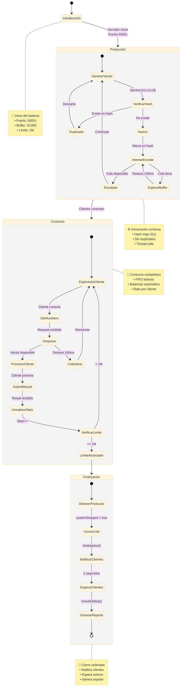
```mermaid
%%{init: {'theme':'base'}}%%
stateDiagram-v2
    [*] --> Inicialización
    
    Inicialización --> Producción: Servidor inicia<br/>Puerto 50051
    
    state Producción {
        [*] --> GenerarVector
        GenerarVector --> VerificarHash: Genera [n1,n2,n3]
        VerificarHash --> Duplicado: Existe en hash
        VerificarHash --> Nuevo: No existe
        Duplicado --> GenerarVector: Descarta
        Nuevo --> IntentarEncolar: Marca en hash
        IntentarEncolar --> Encolado: Cola disponible
        IntentarEncolar --> EsperarBuffer: Cola llena
        EsperarBuffer --> IntentarEncolar: Timeout 100ms
        Encolado --> GenerarVector: Continuar
    }
    
    state Consumo {
        [*] --> EsperandoCliente
        EsperandoCliente --> GetNumbers: Cliente conecta
        GetNumbers --> Dequeue: Request recibido
        Dequeue --> ProcesarCliente: Vector disponible
        Dequeue --> ColaVacia: Timeout 100ms
        ColaVacia --> EsperandoCliente: Reintentar
        ProcesarCliente --> SubmitResult: Cliente procesa
        SubmitResult --> ActualizarStats: Result recibido
        ActualizarStats --> VerificarLimite: Stats++
        VerificarLimite --> EsperandoCliente: < 1M
        VerificarLimite --> LimiteAlcanzado: >= 1M
    }
    
    Producción --> Consumo: Clientes conectan
    
    state Finalización {
        [*] --> DetenerProductor
        DetenerProductor --> CerrarCola: systemStopped = true
        CerrarCola --> NotificarClientes: close(queue)
        NotificarClientes --> EsperarClientes: 2 segundos
        EsperarClientes --> GenerarReporte: GracefulStop()
        GenerarReporte --> [*]
    }
    
    LimiteAlcanzado --> Finalización
    
    note right of Inicialización
        🚀 Inicio del sistema
        • Puerto: 50051
        • Buffer: 10,000
        • Límite: 1M
    end note
    
    note right of Producción
        ⚙️ Generación continua
        • Hash map O(1)
        • Sin duplicados
        • Thread-safe
    end note
    
    note right of Consumo
        👥 Consumo competitivo
        • FIFO estricto
        • Balanceo automático
        • Stats por cliente
    end note
    
    note right of Finalización
        🛑 Cierre ordenado
        • Notifica clientes
        • Espera activos
        • Genera reporte
    end note
```

---

### 🟢 Publisher-Subscriber: Máquina de Estados

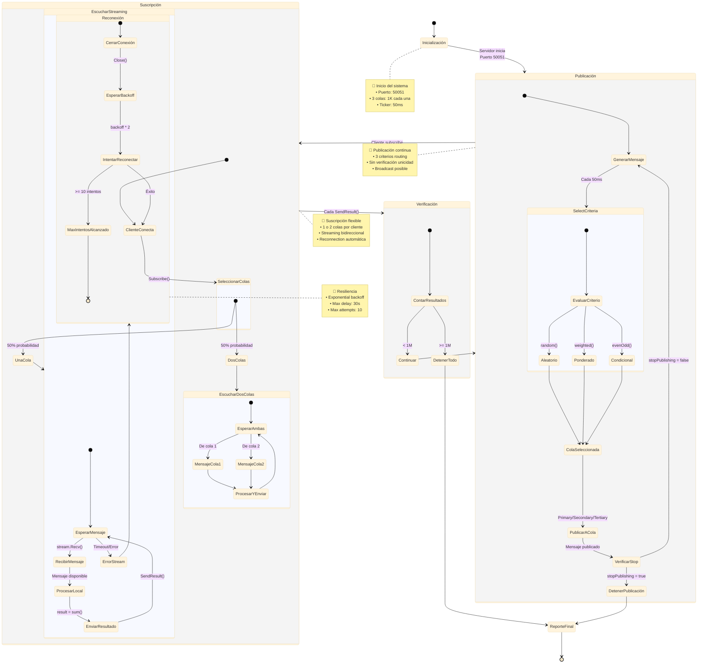
```mermaid
%%{init: {'theme':'base'}}%%
stateDiagram-v2
    [*] --> Inicialización
    
    Inicialización --> Publicación: Servidor inicia<br/>Puerto 50051
    
    state Publicación {
        [*] --> GenerarMensaje
        GenerarMensaje --> SelectCriteria: Cada 50ms
        
        state SelectCriteria {
            [*] --> EvaluarCriterio
            EvaluarCriterio --> Aleatorio: random()
            EvaluarCriterio --> Ponderado: weighted()
            EvaluarCriterio --> Condicional: evenOdd()
            Aleatorio --> ColaSeleccionada
            Ponderado --> ColaSeleccionada
            Condicional --> ColaSeleccionada
        }
        
        ColaSeleccionada --> PublicarACola: Primary/Secondary/Tertiary
        PublicarACola --> VerificarStop: Mensaje publicado
        VerificarStop --> GenerarMensaje: stopPublishing = false
        VerificarStop --> DetenerPublicación: stopPublishing = true
    }
    
    state Suscripción {
        [*] --> ClienteConecta
        ClienteConecta --> SeleccionarColas: Subscribe()
        
        state SeleccionarColas {
            [*] --> UnaCola: 50% probabilidad
            [*] --> DosColas: 50% probabilidad
        }
        
        UnaCola --> EscucharStreaming
        DosColas --> EscucharDosColas
        
        state EscucharStreaming {
            [*] --> EsperarMensaje
            EsperarMensaje --> RecibirMensaje: stream.Recv()
            RecibirMensaje --> ProcesarLocal: Mensaje disponible
            ProcesarLocal --> EnviarResultado: result = sum()
            EnviarResultado --> EsperarMensaje: SendResult()
            EsperarMensaje --> ErrorStream: Timeout/Error
            ErrorStream --> Reconexión
        }
        
        state EscucharDosColas {
            [*] --> EsperarAmbas
            EsperarAmbas --> MensajeCola1: De cola 1
            EsperarAmbas --> MensajeCola2: De cola 2
            MensajeCola1 --> ProcesarYEnviar
            MensajeCola2 --> ProcesarYEnviar
            ProcesarYEnviar --> EsperarAmbas
        }
    }
    
    state Reconexión {
        [*] --> CerrarConexión
        CerrarConexión --> EsperarBackoff: Close()
        EsperarBackoff --> IntentarReconectar: backoff * 2
        IntentarReconectar --> ClienteConecta: Éxito
        IntentarReconectar --> MaxIntentosAlcanzado: >= 10 intentos
        MaxIntentosAlcanzado --> [*]
    }
    
    Publicación --> Suscripción: Cliente subscribe
    
    state Verificación {
        [*] --> ContarResultados
        ContarResultados --> Continuar: < 1M
        ContarResultados --> DetenerTodo: >= 1M
    }
    
    Suscripción --> Verificación: Cada SendResult()
    Continuar --> Publicación
    
    DetenerTodo --> ReporteFinal
    DetenerPublicación --> ReporteFinal
    
    ReporteFinal --> [*]
    
    note right of Inicialización
        🚀 Inicio del sistema
        • Puerto: 50051
        • 3 colas: 1K cada una
        • Ticker: 50ms
    end note
    
    note right of Publicación
        📡 Publicación continua
        • 3 criterios routing
        • Sin verificación unicidad
        • Broadcast posible
    end note
    
    note right of Suscripción
        👥 Suscripción flexible
        • 1 o 2 colas por cliente
        • Streaming bidireccional
        • Reconnection automática
    end note
    
    note right of Reconexión
        🔄 Resiliencia
        • Exponential backoff
        • Max delay: 30s
        • Max attempts: 10
    end note
```

---

## 🌐 Patrones de Comunicación

### 🔵 Point-to-Point (Productor-Consumidor)

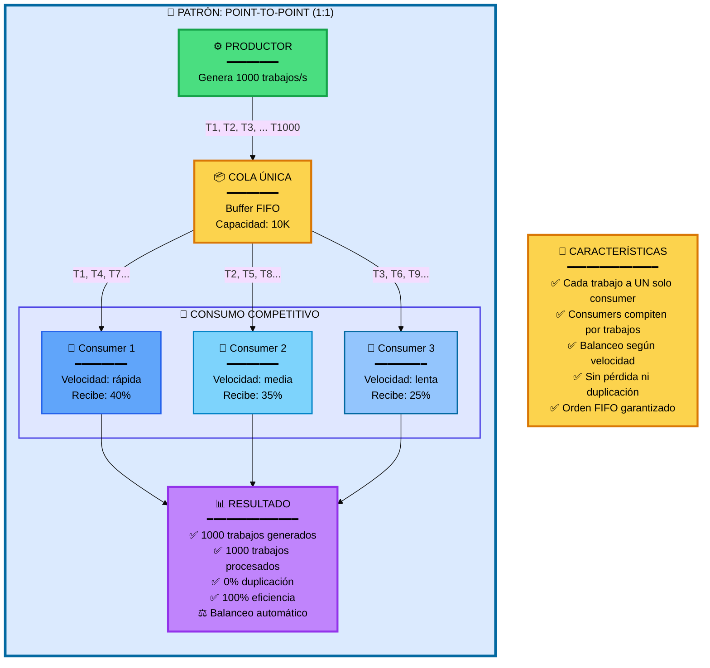
```mermaid
%%{init: {'theme':'base'}}%%
graph TB
    subgraph PATTERN["🎯 PATRÓN: POINT-TO-POINT (1:1)"]
        direction TB
        
        P["⚙️ PRODUCTOR<br/>━━━━━━━━<br/>Genera 1000 trabajos/s"]
        
        Q["📦 COLA ÚNICA<br/>━━━━━━━━<br/>Buffer FIFO<br/>Capacidad: 10K"]
        
        subgraph COMPETITIVE["👥 CONSUMO COMPETITIVO"]
            C1["👤 Consumer 1<br/>━━━━━━━━<br/>Velocidad: rápida<br/>Recibe: 40%"]
            C2["👤 Consumer 2<br/>━━━━━━━━<br/>Velocidad: media<br/>Recibe: 35%"]
            C3["👤 Consumer 3<br/>━━━━━━━━<br/>Velocidad: lenta<br/>Recibe: 25%"]
        end
        
        RESULT["📊 RESULTADO<br/>━━━━━━━━━━━━━━<br/>✅ 1000 trabajos generados<br/>✅ 1000 trabajos procesados<br/>✅ 0% duplicación<br/>✅ 100% eficiencia<br/>⚖️ Balanceo automático"]
        
        P -->|"T1, T2, T3, ... T1000"| Q
        Q -->|"T1, T4, T7..."| C1
        Q -->|"T2, T5, T8..."| C2
        Q -->|"T3, T6, T9..."| C3
        
        C1 & C2 & C3 --> RESULT
    end
    
    CHARS["🎨 CARACTERÍSTICAS<br/>━━━━━━━━━━━━━━<br/>✅ Cada trabajo a UN solo consumer<br/>✅ Consumers compiten por trabajos<br/>✅ Balanceo según velocidad<br/>✅ Sin pérdida ni duplicación<br/>✅ Orden FIFO garantizado"]
    
    style PATTERN fill:#dbeafe,stroke:#0369a1,stroke-width:4px
    style COMPETITIVE fill:#e0e7ff,stroke:#4f46e5,stroke-width:2px
    style P fill:#4ade80,stroke:#16a34a,stroke-width:3px,color:#000
    style Q fill:#fcd34d,stroke:#d97706,stroke-width:3px,color:#000
    style C1 fill:#60a5fa,stroke:#2563eb,stroke-width:2px,color:#000
    style C2 fill:#7dd3fc,stroke:#0284c7,stroke-width:2px,color:#000
    style C3 fill:#93c5fd,stroke:#0369a1,stroke-width:2px,color:#000
    style RESULT fill:#c084fc,stroke:#9333ea,stroke-width:3px,color:#000
    style CHARS fill:#fcd34d,stroke:#d97706,stroke-width:3px,color:#000
```

**📊 Flujo de Datos Detallado:**

```
⚙️ Productor genera:
   T1 [1,2,3] → 📦 Cola

👤 Consumer 1 solicita:
   ← T1 [1,2,3] (Consumer 1 lo recibe)

⚙️ Productor genera:
   T2 [4,5,6] → 📦 Cola

👤 Consumer 2 solicita:
   ← T2 [4,5,6] (Consumer 2 lo recibe, NO Consumer 1)

⚙️ Productor genera:
   T3 [7,8,9] → 📦 Cola

👤 Consumer 3 solicita:
   ← T3 [7,8,9] (Consumer 3 lo recibe)

✅ Resultado: 3 trabajos → 3 resultados únicos
```

---

### 🟢 Publish-Subscribe (Broadcast)

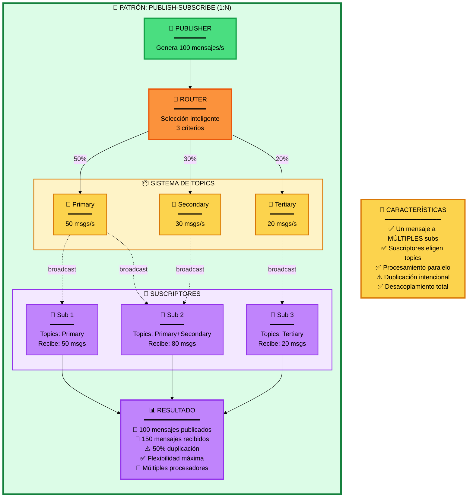
```mermaid
%%{init: {'theme':'base'}}%%
graph TB
    subgraph PATTERN["🎯 PATRÓN: PUBLISH-SUBSCRIBE (1:N)"]
        direction TB
        
        PUB["📡 PUBLISHER<br/>━━━━━━━━<br/>Genera 100 mensajes/s"]
        
        ROUTER["🎯 ROUTER<br/>━━━━━━━━<br/>Selección inteligente<br/>3 criterios"]
        
        subgraph TOPICS["📦 SISTEMA DE TOPICS"]
            T1["📌 Primary<br/>━━━━━━<br/>50 msgs/s"]
            T2["📌 Secondary<br/>━━━━━━<br/>30 msgs/s"]
            T3["📌 Tertiary<br/>━━━━━━<br/>20 msgs/s"]
        end
        
        subgraph SUBS["👥 SUSCRIPTORES"]
            S1["👥 Sub 1<br/>━━━━━━<br/>Topics: Primary<br/>Recibe: 50 msgs"]
            S2["👥 Sub 2<br/>━━━━━━<br/>Topics: Primary+Secondary<br/>Recibe: 80 msgs"]
            S3["👥 Sub 3<br/>━━━━━━<br/>Topics: Tertiary<br/>Recibe: 20 msgs"]
        end
        
        RESULT["📊 RESULTADO<br/>━━━━━━━━━━━━━━<br/>📡 100 mensajes publicados<br/>📨 150 mensajes recibidos<br/>⚠️ 50% duplicación<br/>✅ Flexibilidad máxima<br/>👥 Múltiples procesadores"]
        
        PUB --> ROUTER
        ROUTER -->|"50%"| T1
        ROUTER -->|"30%"| T2
        ROUTER -->|"20%"| T3
        
        T1 -.->|"broadcast"| S1
        T1 -.->|"broadcast"| S2
        T2 -.->|"broadcast"| S2
        T3 -.->|"broadcast"| S3
        
        S1 & S2 & S3 --> RESULT
    end
    
    CHARS["🎨 CARACTERÍSTICAS<br/>━━━━━━━━━━━━━━<br/>✅ Un mensaje a MÚLTIPLES subs<br/>✅ Suscriptores eligen topics<br/>✅ Procesamiento paralelo<br/>⚠️ Duplicación intencional<br/>✅ Desacoplamiento total"]
    
    style PATTERN fill:#dcfce7,stroke:#15803d,stroke-width:4px
    style TOPICS fill:#fef3c7,stroke:#d97706,stroke-width:2px
    style SUBS fill:#f3e8ff,stroke:#9333ea,stroke-width:2px
    style PUB fill:#4ade80,stroke:#16a34a,stroke-width:3px,color:#000
    style ROUTER fill:#fb923c,stroke:#ea580c,stroke-width:3px,color:#000
    style T1 fill:#fcd34d,stroke:#d97706,stroke-width:2px,color:#000
    style T2 fill:#fcd34d,stroke:#d97706,stroke-width:2px,color:#000
    style T3 fill:#fcd34d,stroke:#d97706,stroke-width:2px,color:#000
    style S1 fill:#c084fc,stroke:#9333ea,stroke-width:2px,color:#000
    style S2 fill:#c084fc,stroke:#9333ea,stroke-width:2px,color:#000
    style S3 fill:#c084fc,stroke:#9333ea,stroke-width:2px,color:#000
    style RESULT fill:#c084fc,stroke:#9333ea,stroke-width:3px,color:#000
    style CHARS fill:#fcd34d,stroke:#d97706,stroke-width:3px,color:#000
```

**📊 Flujo de Datos Detallado:**

```
📡 Publisher publica:
   M1 [10,20] → 🎯 Router → 📌 Primary

👥 Sub 1 (suscrito a Primary):
   ← M1 [10,20] (Recibe y procesa)

👥 Sub 2 (suscrito a Primary + Secondary):
   ← M1 [10,20] (También recibe M1)

⚠️ Resultado parcial: 1 mensaje → 2 suscriptores lo reciben

📡 Publisher publica:
   M2 [5,15] → 🎯 Router → 📌 Secondary

👥 Sub 2 (suscrito a Secondary):
   ← M2 [5,15] (Recibe y procesa)

✅ Resultado: 2 mensajes → 3 resultados totales (duplicación)
```

---

## 🔧 Manejo de Errores y Recuperación

### 🔵 Productor-Consumidor: Estrategia de Reintentos

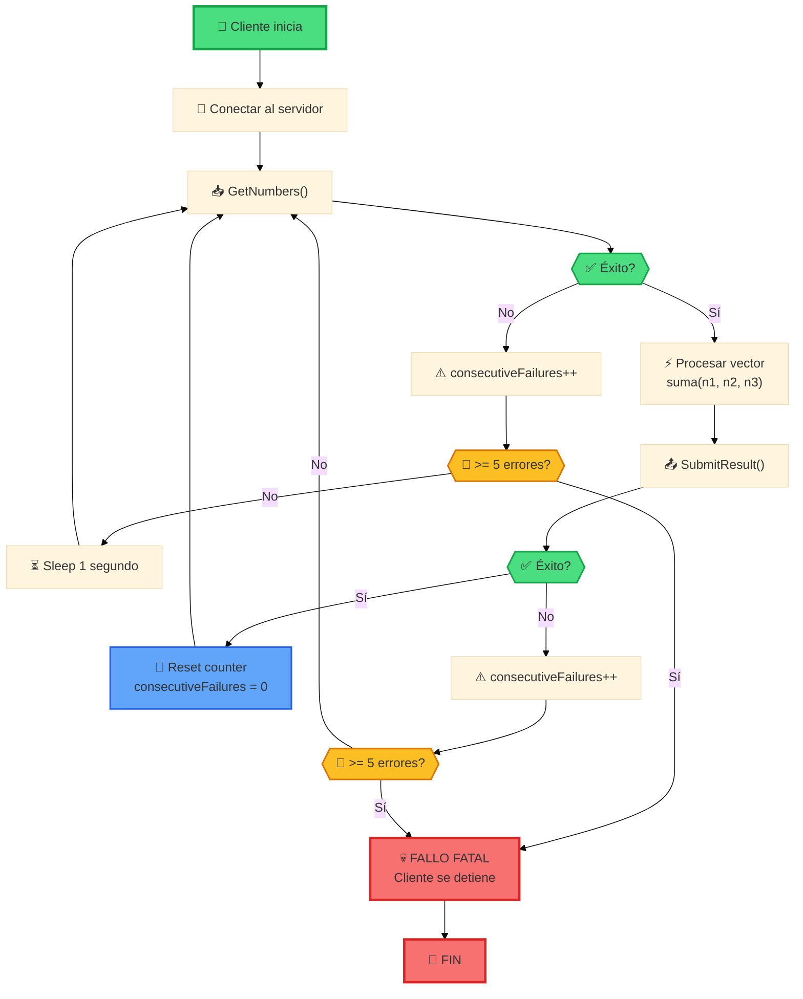
```mermaid
%%{init: {'theme':'base'}}%%
graph TB
    START["🚀 Cliente inicia"] --> CONNECT["🔌 Conectar al servidor"]
    
    CONNECT --> TRY_GET["📥 GetNumbers()"]
    
    TRY_GET --> SUCCESS_GET{{"✅ Éxito?"}}
    
    SUCCESS_GET -->|"Sí"| PROCESS["⚡ Procesar vector<br/>suma(n1, n2, n3)"]
    SUCCESS_GET -->|"No"| ERR_COUNT1["⚠️ consecutiveFailures++"]
    
    ERR_COUNT1 --> CHECK_MAX1{{"🔴 >= 5 errores?"}}
    
    CHECK_MAX1 -->|"Sí"| FATAL["💀 FALLO FATAL<br/>Cliente se detiene"]
    CHECK_MAX1 -->|"No"| WAIT1["⏳ Sleep 1 segundo"]
    
    WAIT1 --> TRY_GET
    
    PROCESS --> TRY_SUBMIT["📤 SubmitResult()"]
    
    TRY_SUBMIT --> SUCCESS_SUBMIT{{"✅ Éxito?"}}
    
    SUCCESS_SUBMIT -->|"Sí"| RESET["🔄 Reset counter<br/>consecutiveFailures = 0"]
    SUCCESS_SUBMIT -->|"No"| ERR_COUNT2["⚠️ consecutiveFailures++"]
    
    ERR_COUNT2 --> CHECK_MAX2{{"🔴 >= 5 errores?"}}
    
    CHECK_MAX2 -->|"Sí"| FATAL
    CHECK_MAX2 -->|"No"| TRY_GET
    
    RESET --> TRY_GET
    
    FATAL --> END["🛑 FIN"]
    
    style START fill:#4ade80,stroke:#16a34a,stroke-width:3px
    style SUCCESS_GET fill:#4ade80,stroke:#16a34a,stroke-width:2px
    style SUCCESS_SUBMIT fill:#4ade80,stroke:#16a34a,stroke-width:2px
    style CHECK_MAX1 fill:#fbbf24,stroke:#d97706,stroke-width:2px
    style CHECK_MAX2 fill:#fbbf24,stroke:#d97706,stroke-width:2px
    style FATAL fill:#f87171,stroke:#dc2626,stroke-width:3px
    style END fill:#f87171,stroke:#dc2626,stroke-width:3px
    style RESET fill:#60a5fa,stroke:#2563eb,stroke-width:2px
```

**🔧 Parámetros de Configuración:**

<table>
<tr>
<th>Parámetro</th>
<th>Valor</th>
<th>Propósito</th>
</tr>
<tr>
<td><code>maxConsecutiveFailures</code></td>
<td><code>5</code></td>
<td>Límite antes de detener cliente</td>
</tr>
<tr>
<td><code>retryDelay</code></td>
<td><code>1s</code></td>
<td>Espera entre reintentos</td>
</tr>
<tr>
<td><code>GetNumbers timeout</code></td>
<td><code>100ms</code></td>
<td>Timeout del RPC</td>
</tr>
<tr>
<td><code>SubmitResult timeout</code></td>
<td><code>2s</code></td>
<td>Timeout del RPC</td>
</tr>
</table>

---

### 🟢 Publisher-Subscriber: Reconexión Exponencial

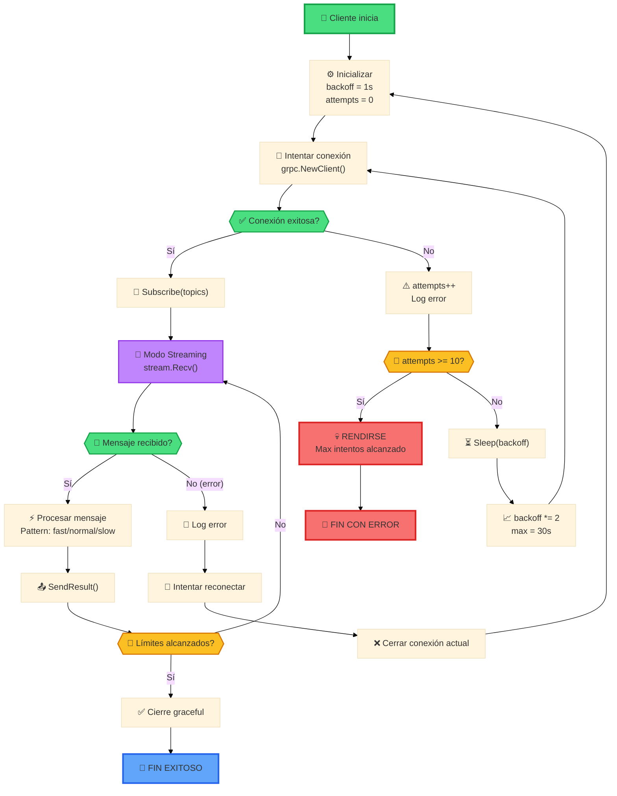
```mermaid
%%{init: {'theme':'base'}}%%
graph TB
    START["🚀 Cliente inicia"] --> INIT_BACKOFF["⚙️ Inicializar<br/>backoff = 1s<br/>attempts = 0"]
    
    INIT_BACKOFF --> TRY_CONNECT["🔌 Intentar conexión<br/>grpc.NewClient()"]
    
    TRY_CONNECT --> CONN_SUCCESS{{"✅ Conexión exitosa?"}}
    
    CONN_SUCCESS -->|"Sí"| SUBSCRIBE["📡 Subscribe(topics)"]
    CONN_SUCCESS -->|"No"| INC_ATTEMPTS["⚠️ attempts++<br/>Log error"]
    
    INC_ATTEMPTS --> CHECK_MAX{{"🔴 attempts >= 10?"}}
    
    CHECK_MAX -->|"Sí"| GIVE_UP["💀 RENDIRSE<br/>Max intentos alcanzado"]
    CHECK_MAX -->|"No"| WAIT_BACKOFF["⏳ Sleep(backoff)"]
    
    WAIT_BACKOFF --> CALC_BACKOFF["📈 backoff *= 2<br/>max = 30s"]
    CALC_BACKOFF --> TRY_CONNECT
    
    SUBSCRIBE --> STREAMING["🌊 Modo Streaming<br/>stream.Recv()"]
    
    STREAMING --> RECV_MSG{{"📨 Mensaje recibido?"}}
    
    RECV_MSG -->|"Sí"| PROCESS_MSG["⚡ Procesar mensaje<br/>Pattern: fast/normal/slow"]
    RECV_MSG -->|"No (error)"| LOG_ERR["📝 Log error"]
    
    PROCESS_MSG --> SEND_RES["📤 SendResult()"]
    
    SEND_RES --> CHECK_LIMITS{{"🎯 Límites alcanzados?"}}
    
    CHECK_LIMITS -->|"No"| STREAMING
    CHECK_LIMITS -->|"Sí"| GRACEFUL["✅ Cierre graceful"]
    
    LOG_ERR --> RECONNECT["🔄 Intentar reconectar"]
    RECONNECT --> CLOSE_CONN["❌ Cerrar conexión actual"]
    CLOSE_CONN --> INIT_BACKOFF
    
    GRACEFUL --> END["🛑 FIN EXITOSO"]
    GIVE_UP --> END_FAIL["🛑 FIN CON ERROR"]
    
    style START fill:#4ade80,stroke:#16a34a,stroke-width:3px
    style CONN_SUCCESS fill:#4ade80,stroke:#16a34a,stroke-width:2px
    style RECV_MSG fill:#4ade80,stroke:#16a34a,stroke-width:2px
    style CHECK_MAX fill:#fbbf24,stroke:#d97706,stroke-width:2px
    style CHECK_LIMITS fill:#fbbf24,stroke:#d97706,stroke-width:2px
    style GIVE_UP fill:#f87171,stroke:#dc2626,stroke-width:3px
    style END fill:#60a5fa,stroke:#2563eb,stroke-width:3px
    style END_FAIL fill:#f87171,stroke:#dc2626,stroke-width:3px
    style STREAMING fill:#c084fc,stroke:#9333ea,stroke-width:2px
```

**🔧 Parámetros de Reconexión:**

<table>
<tr>
<th>Parámetro</th>
<th>Valor Inicial</th>
<th>Máximo</th>
<th>Comportamiento</th>
</tr>
<tr>
<td><code>backoff</code></td>
<td><code>1s</code></td>
<td><code>30s</code></td>
<td>Exponencial: × 2 cada intento</td>
</tr>
<tr>
<td><code>maxAttempts</code></td>
<td><code>-</code></td>
<td><code>10</code></td>
<td>Límite de intentos</td>
</tr>
<tr>
<td><code>maxReconnectDelay</code></td>
<td><code>-</code></td>
<td><code>30s</code></td>
<td>Cap en exponential backoff</td>
</tr>
</table>

**📊 Progresión de Backoff:**

```
Intento 1: 1s
Intento 2: 2s
Intento 3: 4s
Intento 4: 8s
Intento 5: 16s
Intento 6: 30s (capped)
Intento 7: 30s (capped)
...
Intento 10: 30s → GIVE UP
```

---

## 📊 Garantías y Consistencia

### 🎯 Tabla Comparativa de Garantías

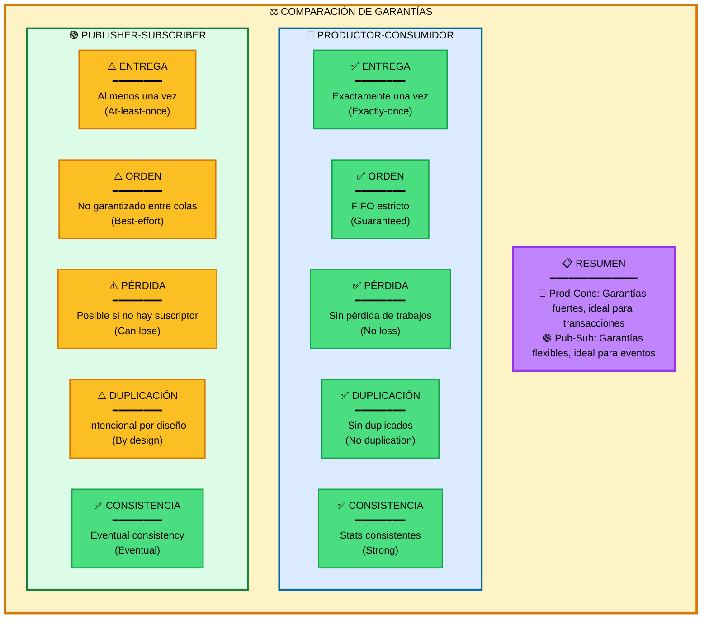
```mermaid
%%{init: {'theme':'base'}}%%
graph TB
    subgraph GUARANTEES["⚖️ COMPARACIÓN DE GARANTÍAS"]
        direction TB
        
        subgraph PC_GUAR["🔵 PRODUCTOR-CONSUMIDOR"]
            PC1["✅ ENTREGA<br/>━━━━━━━━<br/>Exactamente una vez<br/>(Exactly-once)"]
            PC2["✅ ORDEN<br/>━━━━━━━━<br/>FIFO estricto<br/>(Guaranteed)"]
            PC3["✅ PÉRDIDA<br/>━━━━━━━━<br/>Sin pérdida de trabajos<br/>(No loss)"]
            PC4["✅ DUPLICACIÓN<br/>━━━━━━━━<br/>Sin duplicados<br/>(No duplication)"]
            PC5["✅ CONSISTENCIA<br/>━━━━━━━━<br/>Stats consistentes<br/>(Strong)"]
        end
        
        subgraph PS_GUAR["🟢 PUBLISHER-SUBSCRIBER"]
            PS1["⚠️ ENTREGA<br/>━━━━━━━━<br/>Al menos una vez<br/>(At-least-once)"]
            PS2["⚠️ ORDEN<br/>━━━━━━━━<br/>No garantizado entre colas<br/>(Best-effort)"]
            PS3["⚠️ PÉRDIDA<br/>━━━━━━━━<br/>Posible si no hay suscriptor<br/>(Can lose)"]
            PS4["⚠️ DUPLICACIÓN<br/>━━━━━━━━<br/>Intencional por diseño<br/>(By design)"]
            PS5["✅ CONSISTENCIA<br/>━━━━━━━━<br/>Eventual consistency<br/>(Eventual)"]
        end
        
        SUMMARY["📋 RESUMEN<br/>━━━━━━━━━━━━━━<br/>🔵 Prod-Cons: Garantías fuertes, ideal para transacciones<br/>🟢 Pub-Sub: Garantías flexibles, ideal para eventos"]
    end
    
    style GUARANTEES fill:#fef3c7,stroke:#d97706,stroke-width:4px
    style PC_GUAR fill:#dbeafe,stroke:#0369a1,stroke-width:3px
    style PS_GUAR fill:#dcfce7,stroke:#15803d,stroke-width:3px
    
    style PC1 fill:#4ade80,stroke:#16a34a,stroke-width:2px,color:#000
    style PC2 fill:#4ade80,stroke:#16a34a,stroke-width:2px,color:#000
    style PC3 fill:#4ade80,stroke:#16a34a,stroke-width:2px,color:#000
    style PC4 fill:#4ade80,stroke:#16a34a,stroke-width:2px,color:#000
    style PC5 fill:#4ade80,stroke:#16a34a,stroke-width:2px,color:#000
    
    style PS1 fill:#fbbf24,stroke:#d97706,stroke-width:2px,color:#000
    style PS2 fill:#fbbf24,stroke:#d97706,stroke-width:2px,color:#000
    style PS3 fill:#fbbf24,stroke:#d97706,stroke-width:2px,color:#000
    style PS4 fill:#fbbf24,stroke:#d97706,stroke-width:2px,color:#000
    style PS5 fill:#4ade80,stroke:#16a34a,stroke-width:2px,color:#000
    
    style SUMMARY fill:#c084fc,stroke:#9333ea,stroke-width:3px,color:#000
```

---

## ⚡ Escalabilidad Visual

### 🔵 Productor-Consumidor: Escalamiento Horizontal

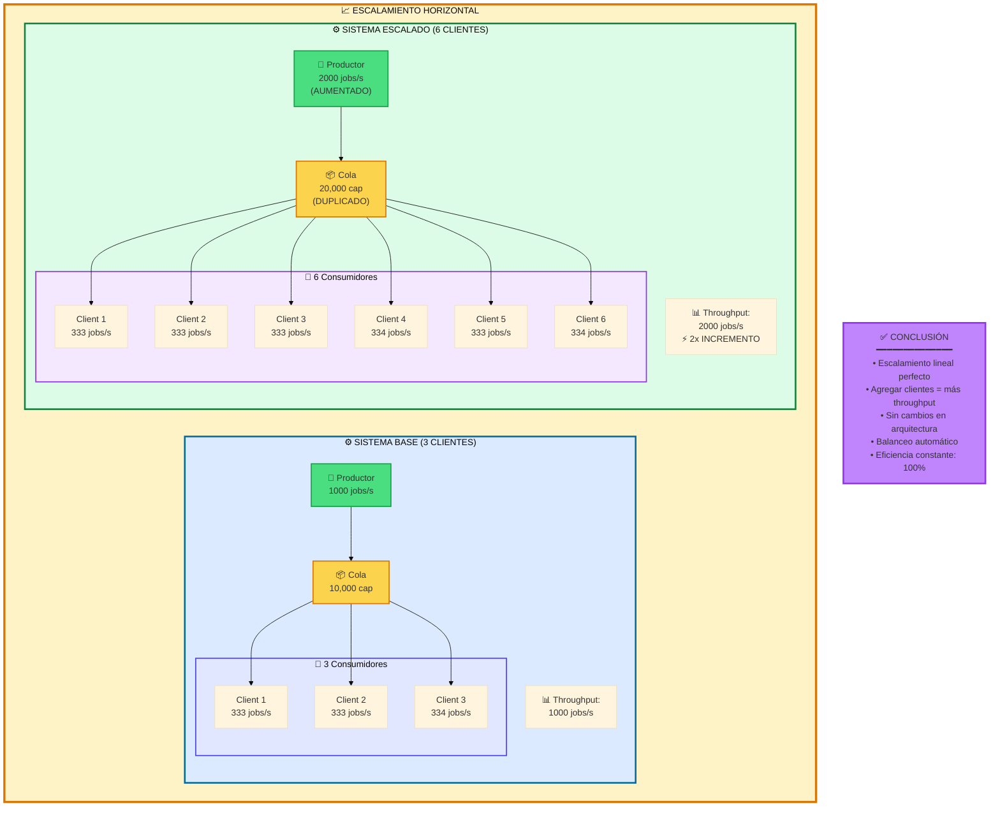
```mermaid
%%{init: {'theme':'base'}}%%
graph TB
    subgraph SCALE["📈 ESCALAMIENTO HORIZONTAL"]
        direction LR
        
        subgraph BASE["⚙️ SISTEMA BASE (3 CLIENTES)"]
            direction TB
            P1["📡 Productor<br/>1000 jobs/s"]
            Q1["📦 Cola<br/>10,000 cap"]
            
            subgraph C_BASE["👥 3 Consumidores"]
                C1_B["Client 1<br/>333 jobs/s"]
                C2_B["Client 2<br/>333 jobs/s"]
                C3_B["Client 3<br/>334 jobs/s"]
            end
            
            P1 --> Q1
            Q1 --> C1_B & C2_B & C3_B
            
            R1["📊 Throughput:<br/>1000 jobs/s"]
        end
        
        subgraph SCALED["⚙️ SISTEMA ESCALADO (6 CLIENTES)"]
            direction TB
            P2["📡 Productor<br/>2000 jobs/s<br/>(AUMENTADO)"]
            Q2["📦 Cola<br/>20,000 cap<br/>(DUPLICADO)"]
            
            subgraph C_SCALED["👥 6 Consumidores"]
                C1_S["Client 1<br/>333 jobs/s"]
                C2_S["Client 2<br/>333 jobs/s"]
                C3_S["Client 3<br/>333 jobs/s"]
                C4_S["Client 4<br/>334 jobs/s"]
                C5_S["Client 5<br/>333 jobs/s"]
                C6_S["Client 6<br/>334 jobs/s"]
            end
            
            P2 --> Q2
            Q2 --> C1_S & C2_S & C3_S
            Q2 --> C4_S & C5_S & C6_S
            
            R2["📊 Throughput:<br/>2000 jobs/s<br/>⚡ 2x INCREMENTO"]
        end
    end
    
    CONCLUSION["✅ CONCLUSIÓN<br/>━━━━━━━━━━━━━━<br/>• Escalamiento lineal perfecto<br/>• Agregar clientes = más throughput<br/>• Sin cambios en arquitectura<br/>• Balanceo automático<br/>• Eficiencia constante: 100%"]
    
    style SCALE fill:#fef3c7,stroke:#d97706,stroke-width:4px
    style BASE fill:#dbeafe,stroke:#0369a1,stroke-width:3px
    style SCALED fill:#dcfce7,stroke:#15803d,stroke-width:3px
    style C_BASE fill:#e0e7ff,stroke:#4f46e5,stroke-width:2px
    style C_SCALED fill:#f3e8ff,stroke:#9333ea,stroke-width:2px
    
    style P1 fill:#4ade80,stroke:#16a34a,stroke-width:2px
    style P2 fill:#4ade80,stroke:#16a34a,stroke-width:2px
    style Q1 fill:#fcd34d,stroke:#d97706,stroke-width:2px
    style Q2 fill:#fcd34d,stroke:#d97706,stroke-width:2px
    style CONCLUSION fill:#c084fc,stroke:#9333ea,stroke-width:3px
```

---

### 🟢 Publisher-Subscriber: Escalamiento por Suscriptores

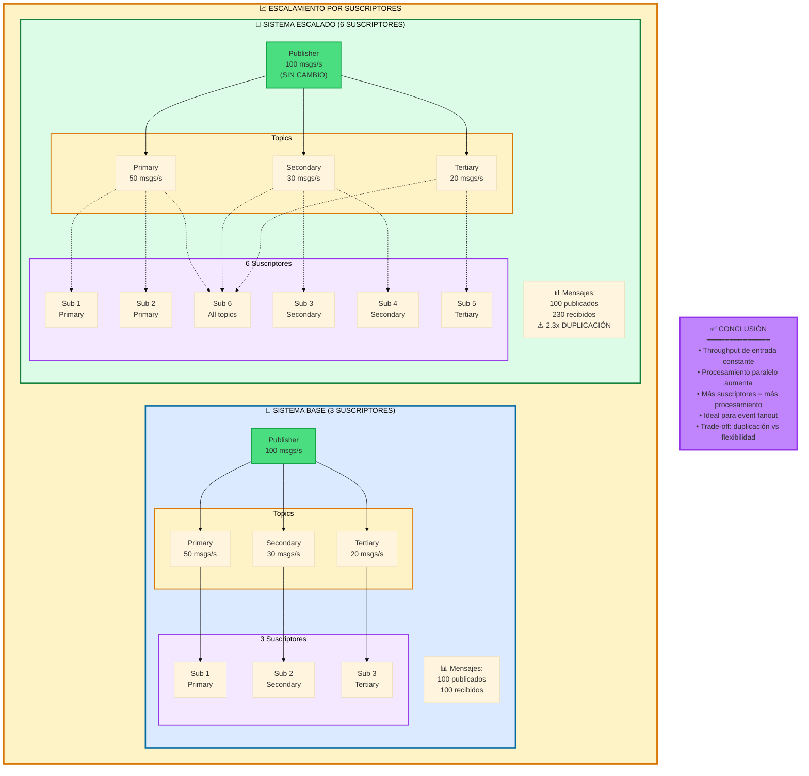
```mermaid
%%{init: {'theme':'base'}}%%
graph TB
    subgraph SCALE["📈 ESCALAMIENTO POR SUSCRIPTORES"]
        direction LR
        
        subgraph BASE["📡 SISTEMA BASE (3 SUSCRIPTORES)"]
            direction TB
            PB1["Publisher<br/>100 msgs/s"]
            
            subgraph TB1["Topics"]
                T1_B["Primary<br/>50 msgs/s"]
                T2_B["Secondary<br/>30 msgs/s"]
                T3_B["Tertiary<br/>20 msgs/s"]
            end
            
            subgraph SB1["3 Suscriptores"]
                S1_B["Sub 1<br/>Primary"]
                S2_B["Sub 2<br/>Secondary"]
                S3_B["Sub 3<br/>Tertiary"]
            end
            
            PB1 --> T1_B & T2_B & T3_B
            T1_B --> S1_B
            T2_B --> S2_B
            T3_B --> S3_B
            
            RB1["📊 Mensajes:<br/>100 publicados<br/>100 recibidos"]
        end
        
        subgraph SCALED["📡 SISTEMA ESCALADO (6 SUSCRIPTORES)"]
            direction TB
            PB2["Publisher<br/>100 msgs/s<br/>(SIN CAMBIO)"]
            
            subgraph TB2["Topics"]
                T1_S["Primary<br/>50 msgs/s"]
                T2_S["Secondary<br/>30 msgs/s"]
                T3_S["Tertiary<br/>20 msgs/s"]
            end
            
            subgraph SB2["6 Suscriptores"]
                S1_S["Sub 1<br/>Primary"]
                S2_S["Sub 2<br/>Primary"]
                S3_S["Sub 3<br/>Secondary"]
                S4_S["Sub 4<br/>Secondary"]
                S5_S["Sub 5<br/>Tertiary"]
                S6_S["Sub 6<br/>All topics"]
            end
            
            PB2 --> T1_S & T2_S & T3_S
            T1_S -.-> S1_S & S2_S & S6_S
            T2_S -.-> S3_S & S4_S & S6_S
            T3_S -.-> S5_S & S6_S
            
            RB2["📊 Mensajes:<br/>100 publicados<br/>230 recibidos<br/>⚠️ 2.3x DUPLICACIÓN"]
        end
    end
    
    CONCLUSION["✅ CONCLUSIÓN<br/>━━━━━━━━━━━━━━<br/>• Throughput de entrada constante<br/>• Procesamiento paralelo aumenta<br/>• Más suscriptores = más procesamiento<br/>• Ideal para event fanout<br/>• Trade-off: duplicación vs flexibilidad"]
    
    style SCALE fill:#fef3c7,stroke:#d97706,stroke-width:4px
    style BASE fill:#dbeafe,stroke:#0369a1,stroke-width:3px
    style SCALED fill:#dcfce7,stroke:#15803d,stroke-width:3px
    style TB1 fill:#fef3c7,stroke:#d97706,stroke-width:2px
    style TB2 fill:#fef3c7,stroke:#d97706,stroke-width:2px
    style SB1 fill:#f3e8ff,stroke:#9333ea,stroke-width:2px
    style SB2 fill:#f3e8ff,stroke:#9333ea,stroke-width:2px
    
    style PB1 fill:#4ade80,stroke:#16a34a,stroke-width:2px
    style PB2 fill:#4ade80,stroke:#16a34a,stroke-width:2px
    style CONCLUSION fill:#c084fc,stroke:#9333ea,stroke-width:3px
```

---

## 🏁 Resumen Visual Final

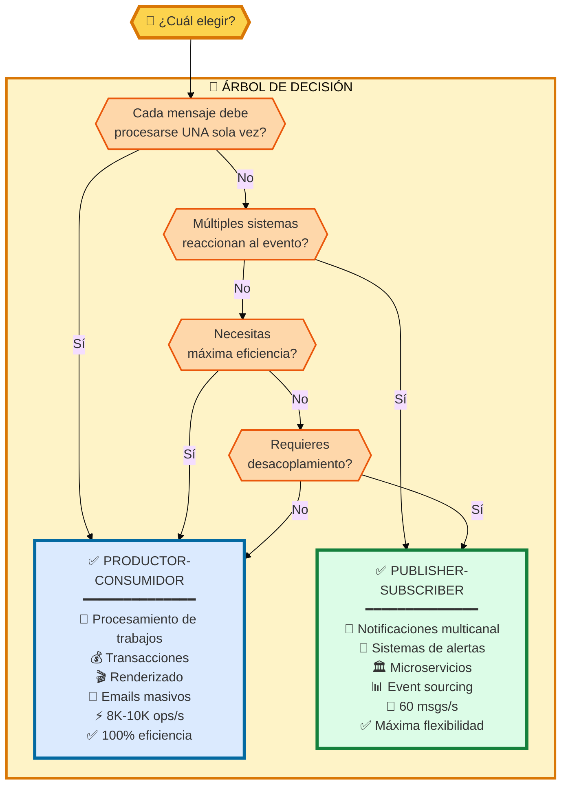
```mermaid
%%{init: {'theme':'base'}}%%
graph TB
    QUESTION{{"🤔 ¿Cuál elegir?"}}
    
    subgraph DECISION["🎯 ÁRBOL DE DECISIÓN"]
        direction TB
        
        Q1{{"Cada mensaje debe<br/>procesarse UNA sola vez?"}}
        Q2{{"Múltiples sistemas<br/>reaccionan al evento?"}}
        Q3{{"Necesitas<br/>máxima eficiencia?"}}
        Q4{{"Requieres<br/>desacoplamiento?"}}
        
        PC["✅ PRODUCTOR-CONSUMIDOR<br/>━━━━━━━━━━━━━━<br/>🎯 Procesamiento de trabajos<br/>💰 Transacciones<br/>🎬 Renderizado<br/>📧 Emails masivos<br/>⚡ 8K-10K ops/s<br/>✅ 100% eficiencia"]
        
        PS["✅ PUBLISHER-SUBSCRIBER<br/>━━━━━━━━━━━━━━<br/>📱 Notificaciones multicanal<br/>🔔 Sistemas de alertas<br/>🏛️ Microservicios<br/>📊 Event sourcing<br/>📡 60 msgs/s<br/>✅ Máxima flexibilidad"]
    end
    
    QUESTION --> Q1
    Q1 -->|"Sí"| PC
    Q1 -->|"No"| Q2
    Q2 -->|"Sí"| PS
    Q2 -->|"No"| Q3
    Q3 -->|"Sí"| PC
    Q3 -->|"No"| Q4
    Q4 -->|"Sí"| PS
    Q4 -->|"No"| PC
    
    style QUESTION fill:#fcd34d,stroke:#d97706,stroke-width:4px
    style DECISION fill:#fef3c7,stroke:#d97706,stroke-width:3px
    style Q1 fill:#fed7aa,stroke:#ea580c,stroke-width:2px
    style Q2 fill:#fed7aa,stroke:#ea580c,stroke-width:2px
    style Q3 fill:#fed7aa,stroke:#ea580c,stroke-width:2px
    style Q4 fill:#fed7aa,stroke:#ea580c,stroke-width:2px
    style PC fill:#dbeafe,stroke:#0369a1,stroke-width:4px
    style PS fill:#dcfce7,stroke:#15803d,stroke-width:4px
```

---

<div align="center">

## 🎨 Leyenda de Colores

| Color | Componente | Uso |
|-------|------------|-----|
| 🟢 Verde | Productor/Publisher | Generación de datos |
| 🟡 Amarillo | Colas/Buffers | Almacenamiento temporal |
| 🔵 Azul | RPC/Networking | Comunicación |
| 🟣 Púrpura | Stats/Clients | Estadísticas y clientes |
| 🟠 Naranja | Router/Control | Routing y control |
| 🔴 Rojo | Errors/Stop | Errores y paradas |

---

**📚 Diagramas basados en implementaciones reales**  
Go 1.21+ | gRPC latest | Mermaid | Noviembre 2025

[](https://github.com)

</div>
