# Diagramas de Arquitectura Detallados
## Productor-Consumidor vs Publisher-Subscriber

## Índice
1. [Visión General Comparativa](#1-visión-general-comparativa)
2. [Flujo de Datos Detallado](#2-flujo-de-datos-detallado)
3. [Secuencia de Operaciones](#3-secuencia-de-operaciones)
4. [Arquitectura de Componentes](#4-arquitectura-de-componentes)
5. [Patrones de Comunicación](#5-patrones-de-comunicación)
6. [Manejo de Errores y Reintentos](#6-manejo-de-errores-y-reintentos)

---

## 1. Visión General Comparativa

### Modelo Productor-Consumidor

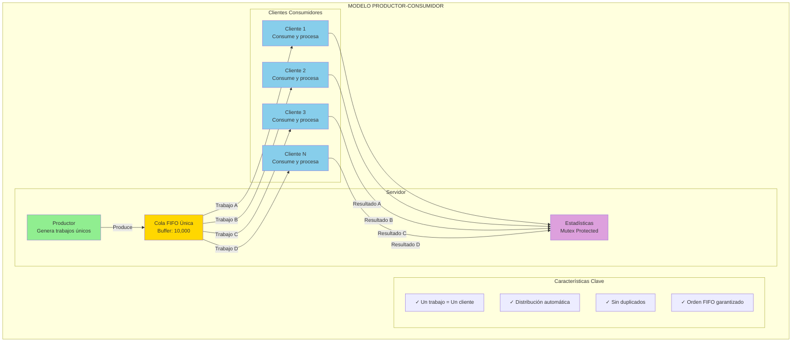

### Modelo Publisher-Subscriber

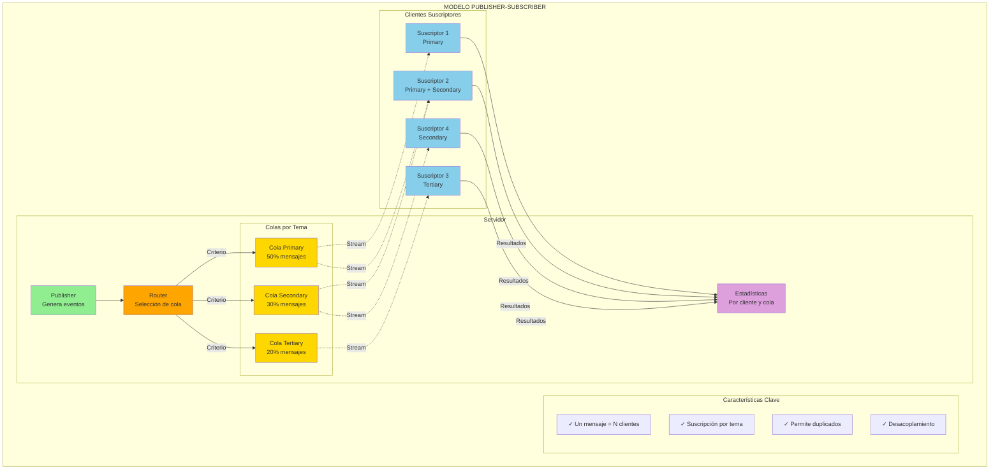

---

## 2. Flujo de Datos Detallado

### Productor-Consumidor: Flujo Completo

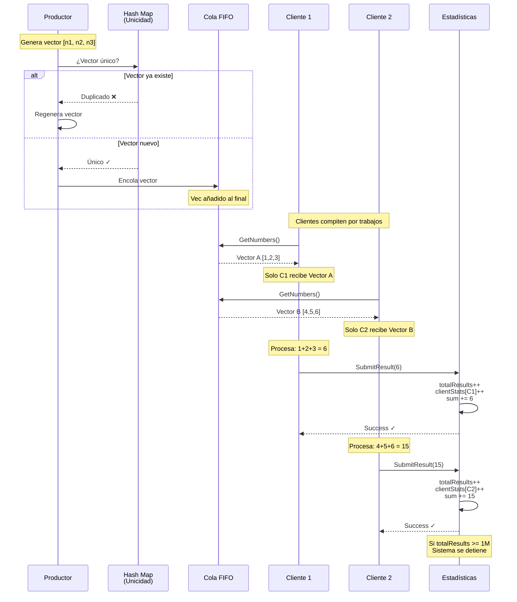

### Publisher-Subscriber: Flujo Completo

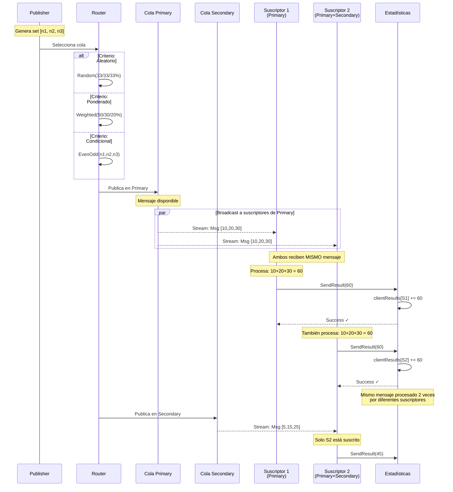

---

## 3. Secuencia de Operaciones

### Productor-Consumidor: Ciclo de Vida Completo

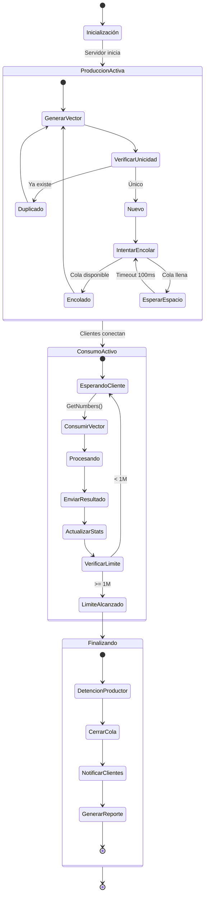

### Publisher-Subscriber: Ciclo de Vida Completo

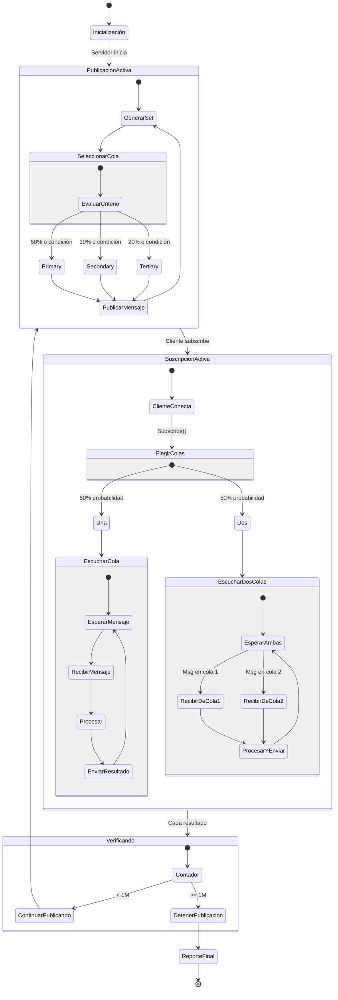

---

## 4. Arquitectura de Componentes

### Productor-Consumidor: Arquitectura Interna

```mermaid
graph TB
    subgraph "SERVIDOR - Arquitectura Interna"
        subgraph "Capa de Producción"
            PG[Productor Goroutine]
            RNG[Generador Random]
            HM[Hash Map<br/>Vectores Únicos]
            VM[vectorMutex]
            
            PG --> RNG
            PG --> HM
            HM --> VM
        end
        
        subgraph "Capa de Cola"
            BC[Buffered Channel<br/>chan Vector<br/>cap: 10,000]
            QM[queueMutex<br/>RWMutex]
            QC[queueClosed<br/>bool]
            
            BC --> QM
            QC --> QM
        end
        
        subgraph "Capa RPC"
            GN[GetNumbers Handler]
            SR[SubmitResult Handler]
            
            GN --> BC
            SR --> STATS
        end
        
        subgraph "Capa de Estadísticas"
            STATS[Stats Manager]
            SM[statsMutex<br/>RWMutex]
            TR[totalResults: int64]
            RS[resultSum: int64]
            CS[clientStats: map]
            
            STATS --> SM
            SM --> TR
            SM --> RS
            SM --> CS
        end
        
        subgraph "Capa de Control"
            SS[systemStopped: bool]
            STM[stopMutex<br/>RWMutex]
            SC[stopChan]
            
            SS --> STM
            SC --> STM
        end
        
        PG -->|produce| BC
        TR -.->|>= 1M| SS
    end
    
    subgraph "CLIENTE - Arquitectura Interna"
        subgraph "Conexión"
            CONN[gRPC Connection]
            KA[Keep-Alive<br/>10s ping]
            
            CONN --> KA
        end
        
        subgraph "Loop Principal"
            REQ[Request Numbers]
            PROC[Procesar<br/>suma(n1,n2,n3)]
            SEND[Send Result]
            
            REQ --> PROC
            PROC --> SEND
            SEND --> REQ
        end
        
        subgraph "Control de Errores"
            ERR[Error Counter]
            RETRY[Retry Logic]
            MAX[Max Failures: 5]
            
            ERR --> MAX
            MAX --> RETRY
        end
        
        CONN --> REQ
        SEND -.->|error| ERR
    end
    
    style PG fill:#90EE90
    style BC fill:#FFD700
    style STATS fill:#DDA0DD
    style SS fill:#FF6B6B
```

### Publisher-Subscriber: Arquitectura Interna

```mermaid
graph TB
    subgraph "SERVIDOR - Arquitectura Interna"
        subgraph "Capa de Publicación"
            PUBG[Publisher Goroutine]
            TICKER[Ticker<br/>50ms]
            MSGID[Message ID<br/>Counter]
            MIM[messageIDMu]
            
            PUBG --> TICKER
            PUBG --> MSGID
            MSGID --> MIM
        end
        
        subgraph "Capa de Routing"
            ROUTER[Router]
            CRIT[Criterio Selección]
            
            subgraph "Criterios"
                ALE[Aleatorio<br/>33/33/33%]
                POND[Ponderado<br/>50/30/20%]
                COND[Condicional<br/>par/impar]
            end
            
            ROUTER --> CRIT
            CRIT --> ALE
            CRIT --> POND
            CRIT --> COND
        end
        
        subgraph "Capa de Colas"
            Q1[Primary Queue<br/>chan *NumberSet<br/>cap: 1,000]
            Q2[Secondary Queue<br/>chan *NumberSet<br/>cap: 1,000]
            Q3[Tertiary Queue<br/>chan *NumberSet<br/>cap: 1,000]
        end
        
        subgraph "Capa RPC"
            SUB[Subscribe Handler<br/>Streaming]
            RES[SendResult Handler]
        end
        
        subgraph "Capa de Estadísticas"
            RESULTS[results: []int]
            CR[clientResults<br/>map[int32][]int]
            CQ[clientQueues<br/>map[int32][]string]
            RM[resultsMu]
            
            RESULTS --> RM
            CR --> RM
            CQ --> RM
        end
        
        subgraph "Capa de Control"
            SP[stopPublishing: bool]
            SPM[stopMu]
            
            SP --> SPM
        end
        
        PUBG --> ROUTER
        ROUTER --> Q1
        ROUTER --> Q2
        ROUTER --> Q3
        
        Q1 --> SUB
        Q2 --> SUB
        Q3 --> SUB
        
        RES --> RESULTS
        RESULTS -.->|>= 1M| SP
    end
    
    subgraph "CLIENTE - Arquitectura Interna"
        subgraph "Configuración"
            CID[Client ID]
            SUBS[Subscriptions<br/>1 o 2 colas]
            PAT[Pattern<br/>fast/normal/slow]
            
            CID --> SUBS
        end
        
        subgraph "Conexión"
            GCONN[gRPC Connection]
            STREAM[Streaming RPC]
            RECONN[Reconnection<br/>Exponential Backoff]
            
            GCONN --> STREAM
            GCONN -.->|fallo| RECONN
        end
        
        subgraph "Loop de Recepción"
            RECV[Receive Message]
            PPROC[Process<br/>según pattern]
            PSEND[Send Result]
            
            RECV --> PPROC
            PPROC --> PSEND
            PSEND --> RECV
        end
        
        subgraph "Límites"
            MAXMSG[Max Messages]
            DUR[Duration]
            STOP[Should Stop]
            
            MAXMSG --> STOP
            DUR --> STOP
        end
        
        SUBS --> STREAM
        STREAM --> RECV
        PSEND -.->|check| STOP
    end
    
    style PUBG fill:#90EE90
    style ROUTER fill:#FFA500
    style Q1 fill:#FFD700
    style Q2 fill:#FFD700
    style Q3 fill:#FFD700
    style RESULTS fill:#DDA0DD
    style SP fill:#FF6B6B
```

---

## 5. Patrones de Comunicación

### Productor-Consumidor: Comunicación Point-to-Point

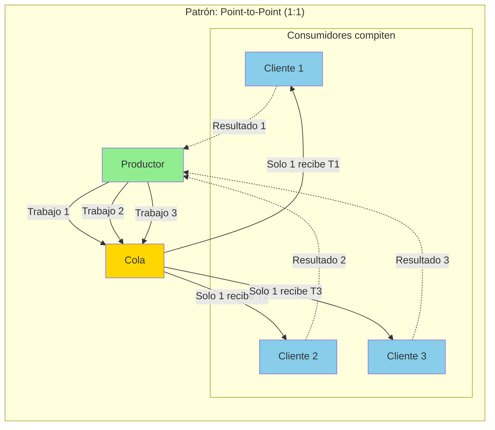

**Características**:
- ✅ Consumo competitivo
- ✅ Sin duplicación
- ✅ Balanceo automático
- ❌ Sin flexibilidad de routing

### Publisher-Subscriber: Comunicación Broadcast

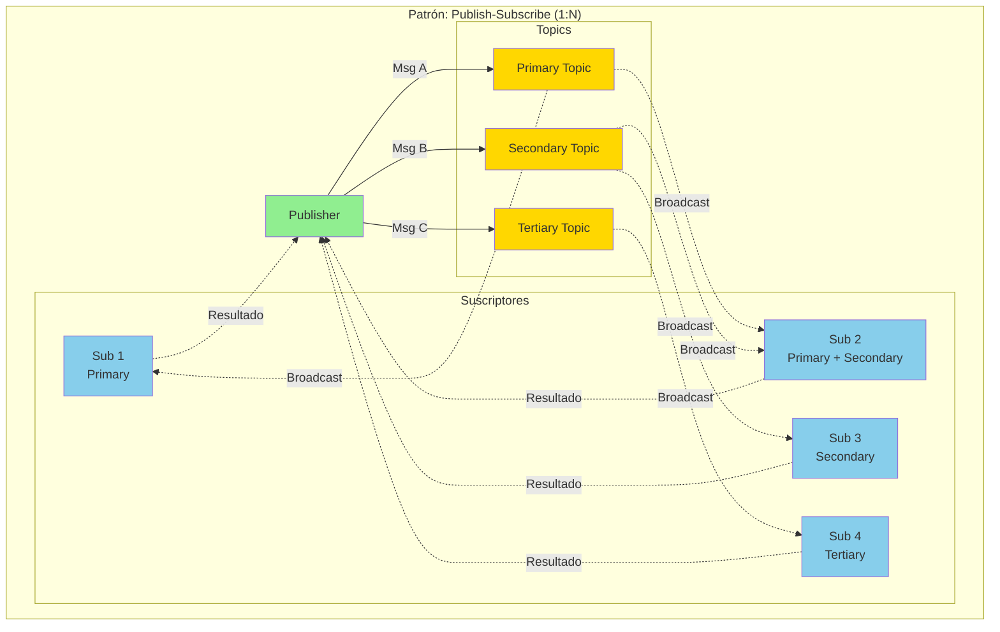

**Características**:
- ✅ Multicasting por tema
- ✅ Suscripción flexible
- ✅ Desacoplamiento
- ⚠️ Posible duplicación

---

## 6. Manejo de Errores y Reintentos

### Productor-Consumidor: Estrategia de Errores

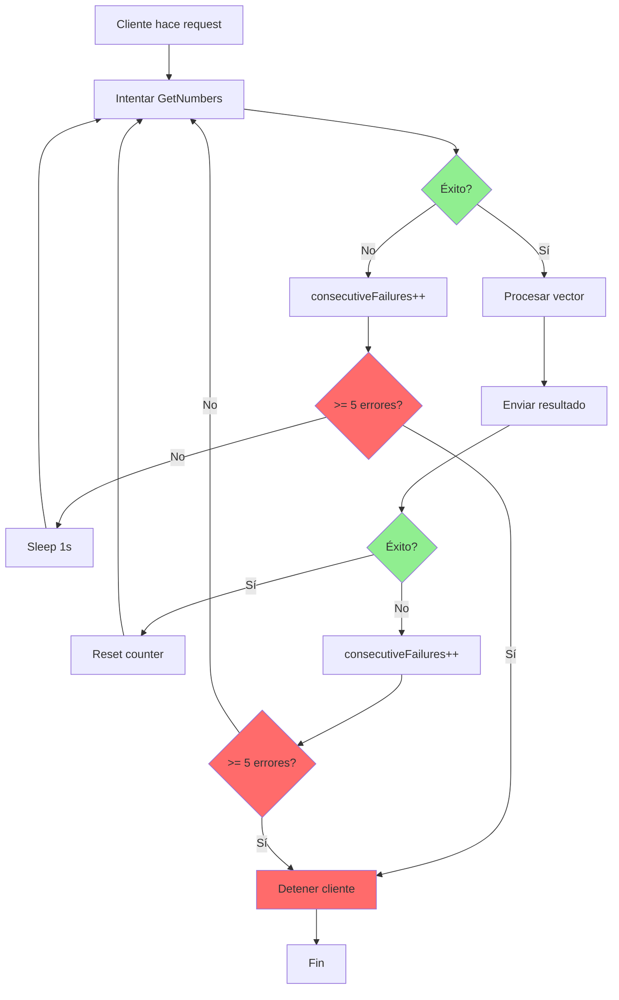

### Publisher-Subscriber: Estrategia de Reconexión

```mermaid
graph TB
    START[Cliente inicia] --> CONN[Intentar conectar]
    
    CONN --> CONNSUC{Conexión exitosa?}
    
    CONNSUC -->|Sí| SUBS[Subscribe a colas]
    CONNSUC -->|No| BACKOFF[Exponential backoff]
    
    BACKOFF --> ATT[attempts++]
    ATT --> MAXATT{>= 10 intentos?}
    
    MAXATT -->|Sí| FAIL[Fallo fatal]
    MAXATT -->|No| WAIT[Esperar backoff time]
    
    WAIT --> CALCBACK[backoff = min(backoff*2, 30s)]
    CALCBACK --> CONN
    
    SUBS --> RECV[Recibir mensajes]
    
    RECV --> RECVERR{Error stream?}
    
    RECVERR -->|No| PROC[Procesar mensaje]
    RECVERR -->|Sí| LOG[Log error]
    
    PROC --> SEND[Enviar resultado]
    
    SEND --> CHECKERR{Error envío?}
    
    CHECKERR -->|No| RECV
    CHECKERR -->|Sí| LOG2[Log error]
    
    LOG --> RECONN[Intentar reconectar]
    LOG2 --> RECV
    
    RECONN --> CLOSE[Cerrar conexión]
    CLOSE --> CONN
    
    FAIL --> END[Fin con error]
    
    style CONNSUC fill:#90EE90
    style RECVERR fill:#FFD700
    style CHECKERR fill:#FFD700
    style MAXATT fill:#FF6B6B
    style FAIL fill:#FF6B6B
```

---

## 7. Comparación Visual de Garantías

### Productor-Consumidor: Garantías Fuertes

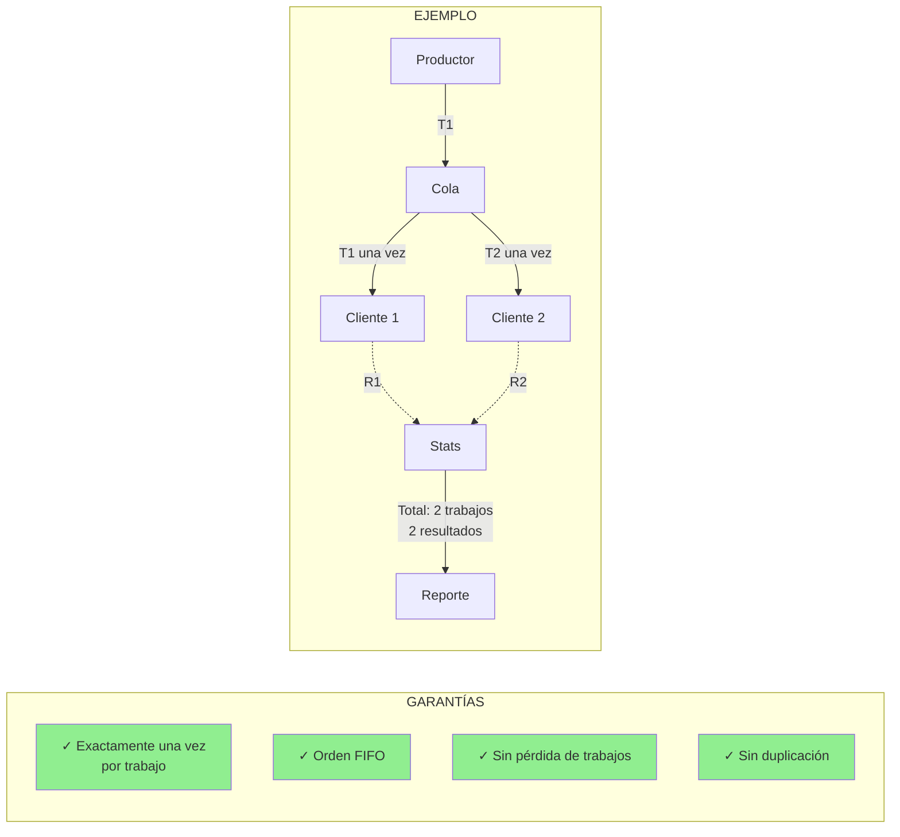

### Publisher-Subscriber: Garantías Flexibles

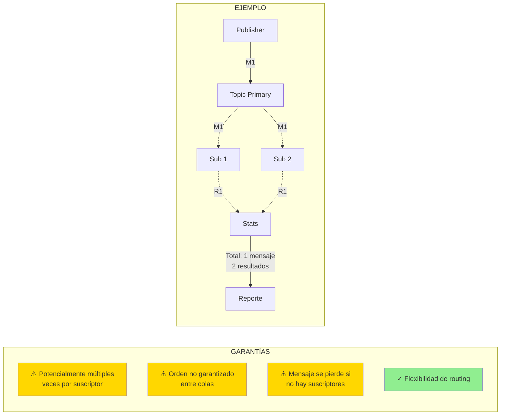

---

## 8. Escalabilidad Visual

### Productor-Consumidor: Escalabilidad Horizontal

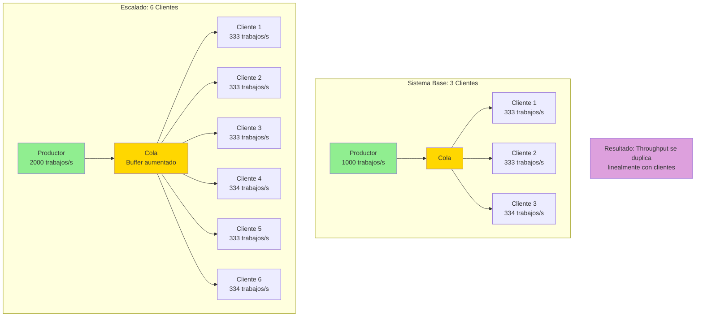

### Publisher-Subscriber: Escalabilidad por Temas

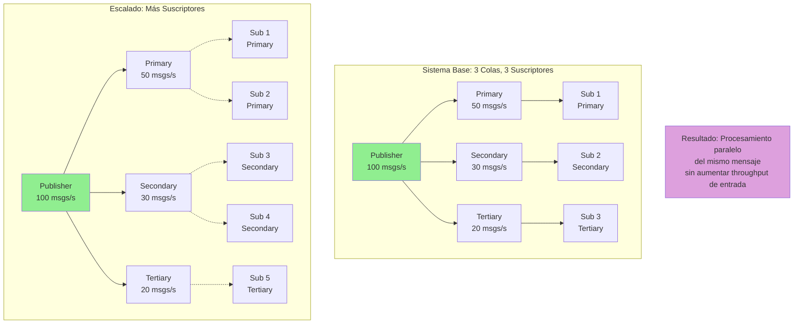

---

## Resumen Visual

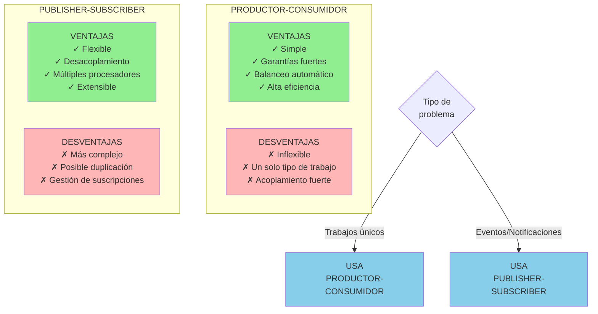

---

**Fecha**: Noviembre 2025  
**Autor**: Análisis basado en implementaciones reales en Go con gRPC
